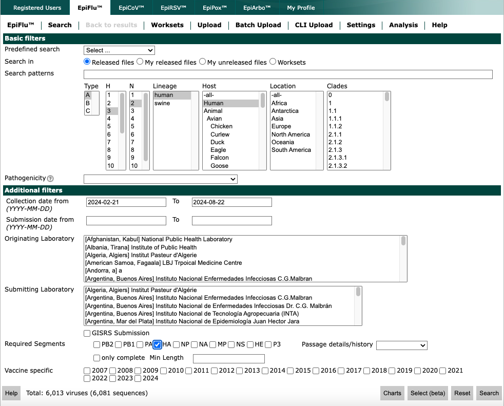
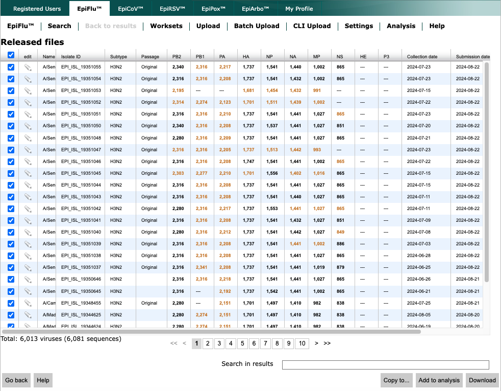
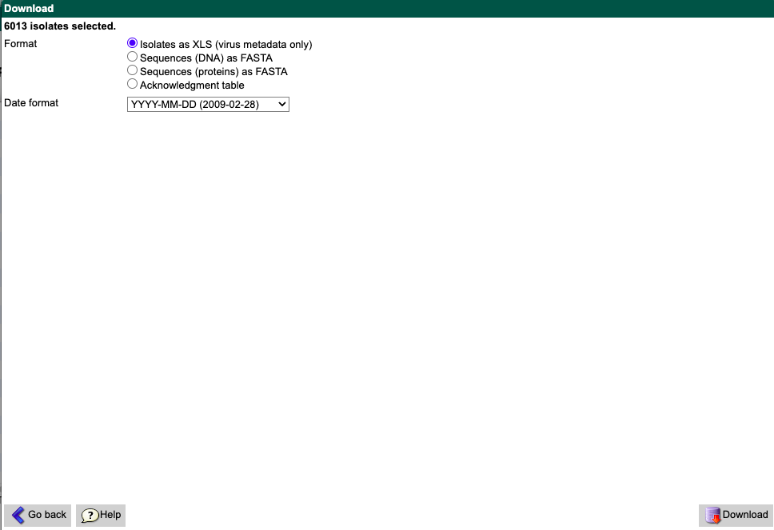
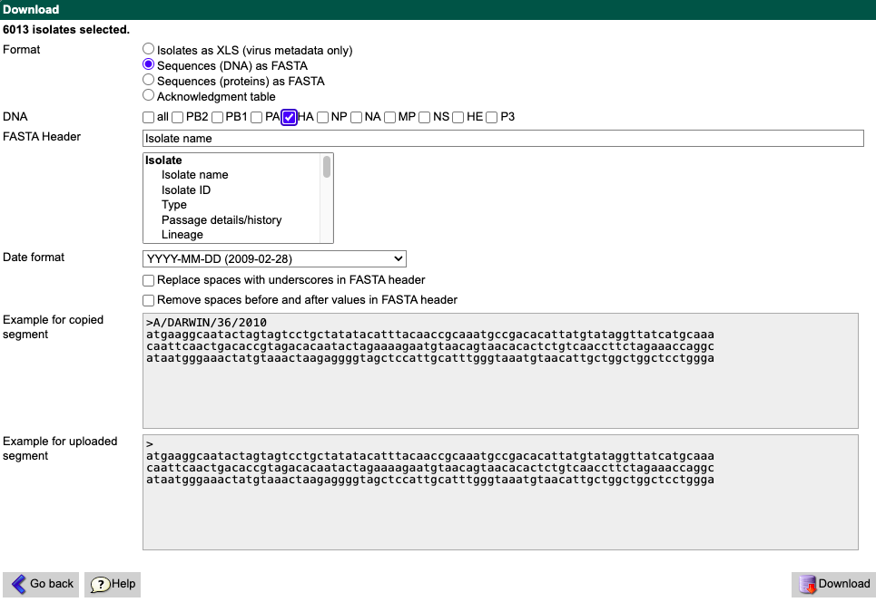
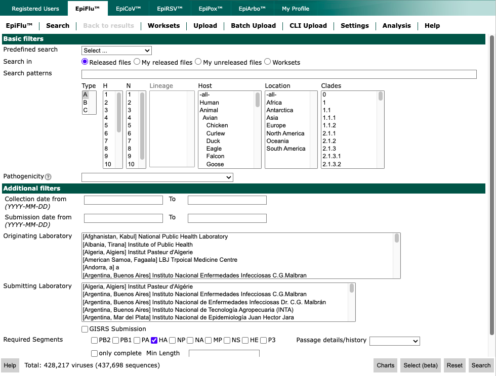
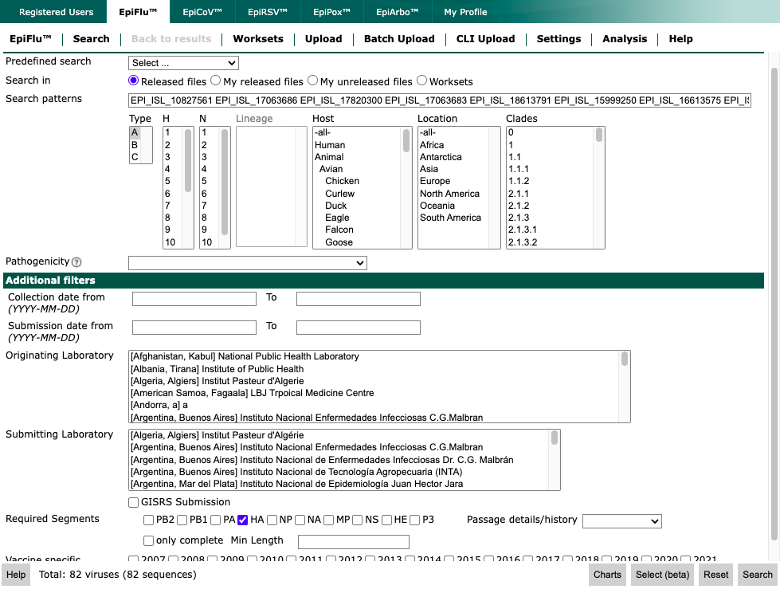
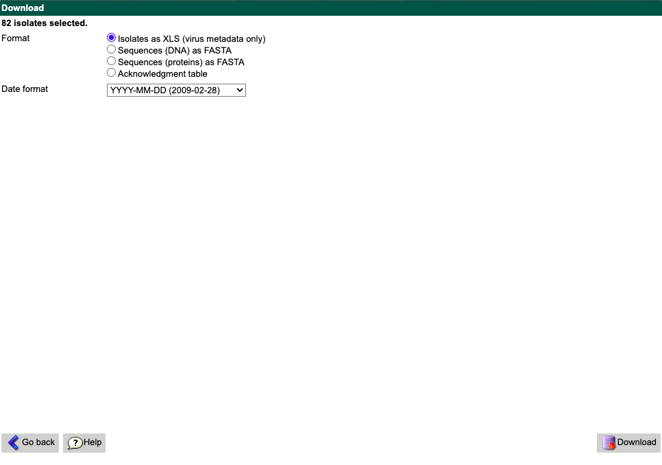
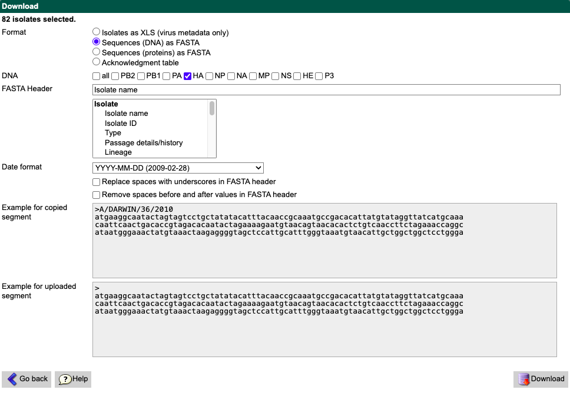

# GISAID File Custom Demo

## Assumptions, Prerequisites, and Software Install

This walkthrough assumes you have beginner knowledge of unix commands and directory navigation through command line.
If you do not, and are a Windows user, the following [tutorial](https://learn.microsoft.com/en-us/windows/wsl/tutorials/linux)
provides some of the basics.

A text editor will also be very helpful. If you do not currently have one installed or do not have a preferred editor,
[VS Code](https://code.visualstudio.com/) is excellent and free. There is also an [in-browser version of VS Code](https://vscode.dev/) if
you'd like to try it without installing.

If you are running a Windows machine you will need to install WSL (Windows Subsystem for Linux).
Follow the [install instructions provided by Microsoft](https://learn.microsoft.com/en-us/windows/wsl/install).

You must also install Nextstrain using the following [installation instructions](https://docs.nextstrain.org/en/latest/install.html).
For the **Set up a Nextstrain runtime** install section, choose the **Conda** option.

Once you have installed Nextstrain:

1. Enter into the nextstrain shell.
   ``` bash
   nextstrain shell .
   ```
2. Install the `xlrd` package.
   ``` bash
   pip install xlrd
   ```
3. Exit the nextstrain shell.
   ``` bash
   exit
   ```

After completing these steps successfully you will be ready to run the demo.

## Brief Nextstrain Overview

Nextstrain is an end-to-end software suite where you can process sequencing data with associated metadata to produce and view
analytic visualizations that focus around a phylogenetic tree.

Nextstrain's two primary software components are:
1. [augur](https://docs.nextstrain.org/projects/augur/en/stable/usage/usage.html) - analysis and processing toolkit
2. [auspice](https://docs.nextstrain.org/projects/auspice/en/stable/) - interactive tool for viewing phylogenomic data

Additionally, there is a stand-alone browser version of `auspice`, [`auspice.us`](https://auspice.us/). This can be
useful for private viewing of builds and associated metadata.

Behind the hood, Nextstrain uses [Snakemake](https://snakemake.readthedocs.io/en/stable/) (a workflow manager written in python)
to run build workflows with specified augur commands and overarching build YAML files. We won't be editing these files much,
but it's good to be generally aware of what components there are behind the hood.

## Demo Build Walkthrough

For this demo build we'll be following much of the [Quickstart with GISAID data section](https://github.com/nhassell/seasonal-flu-demo/tree/master?tab=readme-ov-file#quickstart-with-gisaid-data)
described in the `README.md`, we'll be doing some modifications to create a build with preferential sampling of Asia/Vietnam and adding
in current reference viruses for H3N2. This should give some general ideas of how to create a custom build directly from GISAID downloads.

Start by cloning this repository to a directory of your choice that is easy for you to find.

``` bash
git clone https://github.com/nhassell/seasonal-flu-demo.git
```

Navigate into the cloned directory.
``` bash
cd seasonal-flu-demo
```

### Downloading Sample Data

Create a new directory for the data we will be downloading in the `seasonal-flu-demo` working directory.

``` bash
mkdir -p data/h3n2/
```

Navigate to [GISAID](http://gisaid.org).
Select the "EpiFlu" link in the top navigation bar and then select "Search" from the EpiFlu navigation bar.
From the search interface, select A/H3N2 human samples collected in the last six months, as shown in the example below.


Make sure under the "Required Segments" section at the bottom of the page that "HA" is selected.
Then select the "Search" button.
Select the checkbox in the top-left corner of the search results (the same row with the column headings),
to select all matching records as shown below.



Select the "Download" button.
From the "Download" window that appears, select "Isolates as XLS (virus metadata only)" and then select the "Download" button.



It may take a little while to download the information. Be patient.

Save the XLS file you downloaded (e.g., `gisaid_epiflu_isolates.xls`) in the `data/h3n2/` folder you created
earlier as `metadata.xls`.

Return to the GISAID "Download" window, and select "Sequences (DNA) as FASTA".
In the "DNA" section, select the checkbox for "HA".
In the "FASTA Header" section, enter only `Isolate name`.
Leave all other sections at the default values.



Select the "Download" button.
Save the FASTA file you downloaded (e.g., `gisaid_epiflu_sequences.fasta`) as `raw_sequences_ha.fasta` in the
`data/h3n2/` folder.

### Downloading Reference Data

In order to give our builds a bit more context we will also be downloading current reference viruses for H3N2.

Navigate back to the "EpiFlu" search page and clear out all the previous search options with the exception of 
"Type" and "Required Segments".



After clearing your search copy the following epi isolate accessions and paste them into the "Search patterns"
text box.

```
EPI_ISL_10827561 EPI_ISL_17063686 EPI_ISL_17820300 EPI_ISL_17063683 EPI_ISL_18613791 EPI_ISL_15999250 EPI_ISL_16613575 EPI_ISL_18666931 EPI_ISL_15724431 EPI_ISL_15724444 EPI_ISL_18406536 EPI_ISL_17625825 EPI_ISL_12579955 EPI_ISL_18543831 EPI_ISL_18543862 EPI_ISL_18604311 EPI_ISL_18666938 EPI_ISL_18604225 EPI_ISL_17811530 EPI_ISL_18486188 EPI_ISL_16043979 EPI_ISL_16465201 EPI_ISL_19175843 EPI_ISL_12713450 EPI_ISL_6915282 EPI_ISL_13983344 EPI_ISL_3837314 EPI_ISL_3837458 EPI_ISL_16003435 EPI_ISL_18485082 EPI_ISL_3534319 EPI_ISL_12240116 EPI_ISL_17212772 EPI_ISL_15726914 EPI_ISL_18857240 EPI_ISL_18068808 EPI_ISL_18454576 EPI_ISL_18485122 EPI_ISL_18584697 EPI_ISL_18853720 EPI_ISL_18744435 EPI_ISL_6306633 EPI_ISL_16968012 EPI_ISL_17832071 EPI_ISL_18798261 EPI_ISL_17801747 EPI_ISL_18069017 EPI_ISL_6915290 EPI_ISL_18870832 EPI_ISL_17957622 EPI_ISL_13983961 EPI_ISL_9402025 EPI_ISL_16947044 EPI_ISL_19175850 EPI_ISL_14467639 EPI_ISL_14212950 EPI_ISL_18812000 EPI_ISL_12646699 EPI_ISL_18390020 EPI_ISL_16545579 EPI_ISL_18613797 EPI_ISL_18857248 EPI_ISL_17465772 EPI_ISL_18069022 EPI_ISL_17465773 EPI_ISL_13655506 EPI_ISL_18037501 EPI_ISL_16613698 EPI_ISL_15621105 EPI_ISL_17612291 EPI_ISL_18856681 EPI_ISL_16003430 EPI_ISL_14115546 EPI_ISL_18919792 EPI_ISL_18919795 EPI_ISL_16864398 EPI_ISL_14333098 EPI_ISL_18864876 EPI_ISL_18604205 EPI_ISL_18604240 EPI_ISL_18666943 EPI_ISL_17801751
```



Select the "Search" button. Select all with the top-left corner checkbox.
Select the "Download" button.
From the "Download" window that appears, select "Isolates as XLS (virus metadata only)" and then select the "Download" button.



Save the XLS file you downloaded (e.g., `gisaid_epiflu_isolates.xls (1)`) as `references.xls` in the `data/h3n2/` folder.

Return to the GISAID "Download" window, and select "Sequences (DNA) as FASTA".
In the "DNA" section, select the checkbox for "HA".
In the "FASTA Header" section, enter only `Isolate name`.
Leave all other sections at the default values.



Select the "Download" button.
Save the FASTA file you downloaded (e.g., `gisaid_epiflu_sequences.fasta (1)`) as `references_ha.fasta` in the `data/h3n2/` folder.

### Running the Custom Workflow

Run the Nextstrain workflow for these data to produce an annotated phylogenetic tree of recent A/H3N2 HA data with the following command.

``` bash
nextstrain build . --configfile profiles/gisaid/vietnam.yaml
```

You will see all the "rules" of the Snakemake workflow executing and the direct commands for each rule as the process executes.
This process takes the raw data, cleans/transforms it, aligns it to the appropriate reference frame using nextalign, generates
a phylogenetic tree using [IQ-TREE](http://www.iqtree.org/), estimates a time-scaled phylogeny using [treetime](https://github.com/neherlab/treetime),
along with many other steps to produce the build JSON files.

When the workflow finishes running, visualize the resulting tree with the following command.

``` bash
nextstrain view auspice
```

This will run `auspice` locally on your computer and launch the build in browser. The build JSON files are also directly available in the
`auspice/` folder (`vietnam_h3n2_ha.json` & `vietnam_h3n2_ha_tip-frequencies.json`). You can also drag/drop these files into 
[auspice.us](https://auspice.us/) if you run into any issues launching auspice locally or want to share the build with someone who
does not have Nextstrain installed.

This is all well and good, but what was changed from the default gisaid build profile to generate this custom build?

### Build Customization

Build customization used to be a much more arduous process where one needed to understand how and where to modify the 
rules within the Snakemake files. However, nextstrain has made much of this process easier by implementing 
a lot of pre-configuration and higher level controls within simplified 
[workflow config files](https://docs.nextstrain.org/projects/ncov/en/latest/guides/workflow-config-file.html)
written in [YAML](https://yaml.org/).

The workflow config is the main file to modify workflow execution and sampling. For our build this was the file `profiles/gisaid/vietnam.yaml`.

Take a look at the file contents of `profiles/gisaid/vietnam.yaml` compared to `profiles/gisaid/builds.yaml`.

Much of it has remained the same, but there are several changes.

First, we have changed the `custom_rules` definition.
``` yaml
custom_rules:
  - profiles/gisaid/prepare_data_vietnam.smk
```

Take a quick look at the file `profiles/gisaid/prepare_data_vietnam.smk` compared to `profiles/gisaid/prepare_data.smk`.
Code execution has been added to the `shell` portions of these rules to also process the reference data we downloaded and 
concatenate it with the sample data.

Second, we've changed the `auspice_config` definition.
``` yaml
      auspice_config: "config/h3n2/auspice_config_vietnam.json"
```

The build config now refers to a customized JSON configuration where we've edited the build title and contact information.

Third, we've added the `root` and `include` definition.
``` yaml
      root: A/Darwin/6/2021
      include: "config/h3n2/cdc_reference_strains.txt"
```

This sets `A/Darwin/6/2021` as the root from our reference metadata and defines an inclusion file location for all of our
references we would like to force to be included. This file (`config/h3n2/cdc_reference_strains.txt`) is a list of the
references `strain` field definition from our metadata.

Lastly, we have altered the `subsamples` definition.
``` yaml
      subsamples:
        global:
            filters: "--group-by country year month --subsample-max-sequences 50 --include {include} --exclude-where 'region=asia'"
        asia:
            filters: "--group-by country year month --subsample-max-sequences 100 --include {include} --exclude-where 'region!=asia'"
        vietnam:
            filters: "--group-by division year month --subsample-max-sequences 100 --include {include} --exclude-where 'country!=vietnam'"
```

This changes our sub-sampling to contain three sub-sampling strategies that can be altered individually.
Our `global` sampling samples by country, year and month excluding the asia region.
Our `asia` sampling samples by country, year, and month only from asia.
Our `vietnam` sampling samples by division, year, and month only from Vietnam.

All sub-sampling strategies have the `--include {include}` flag so our file defined by `include` is passed to keep our reference strains.

Explore the other configuration files in `profiles/`, to see examples of how you can build more complex Nextstrain workflows for influenza.

### Bonus: Adding Extra (or Sensitive) Data

If you need to add extra (or sensitive) data to your build that needs to be kept separate, this can be done within a
CSV/TSV/XLSX file. Follow the [guide provided by Nextstrain for more in-depth details](https://docs.nextstrain.org/projects/auspice/en/stable/advanced-functionality/drag-drop-csv-tsv.html).

There is an example file (`profiles/gisaid/secrets.tsv`) included in this repo that you can drag/drop onto the demo build.

This will create a custom coloration category of `data_type` that colors sample and reference tips.