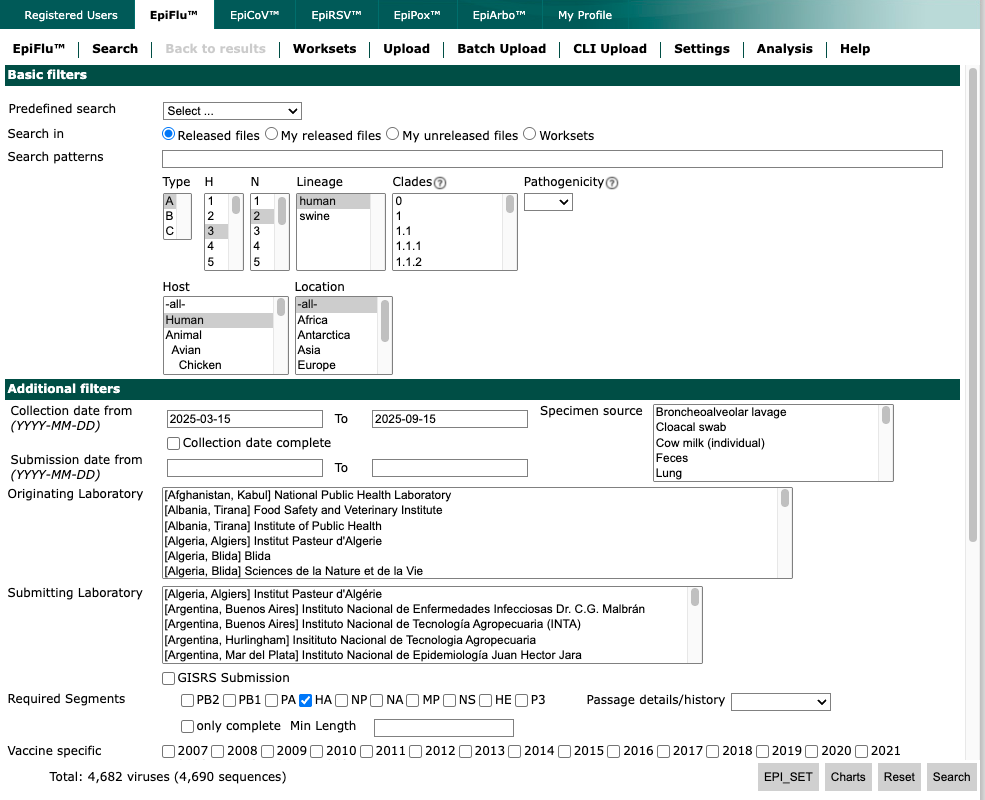
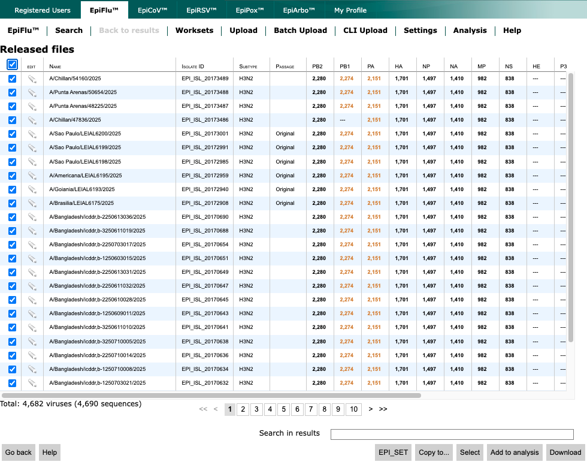
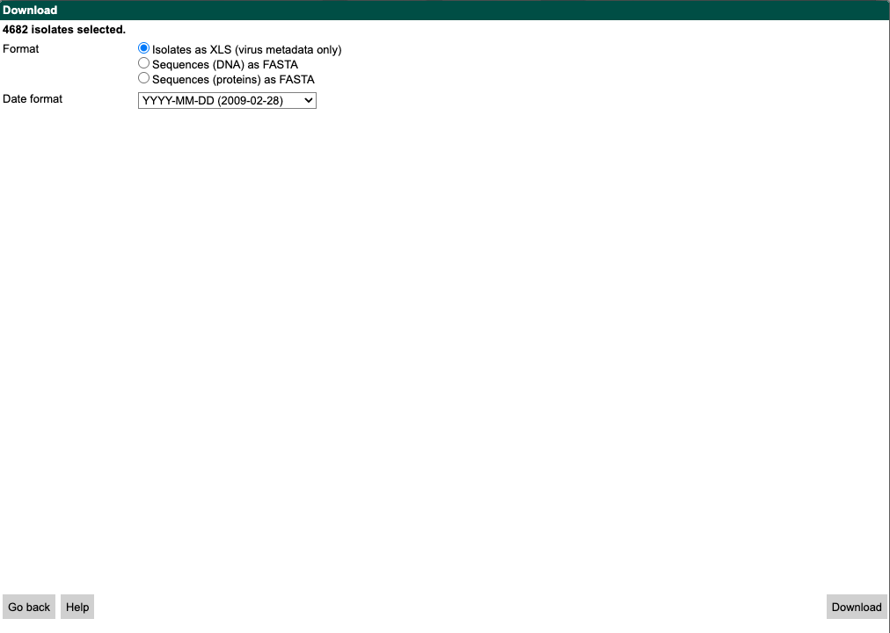
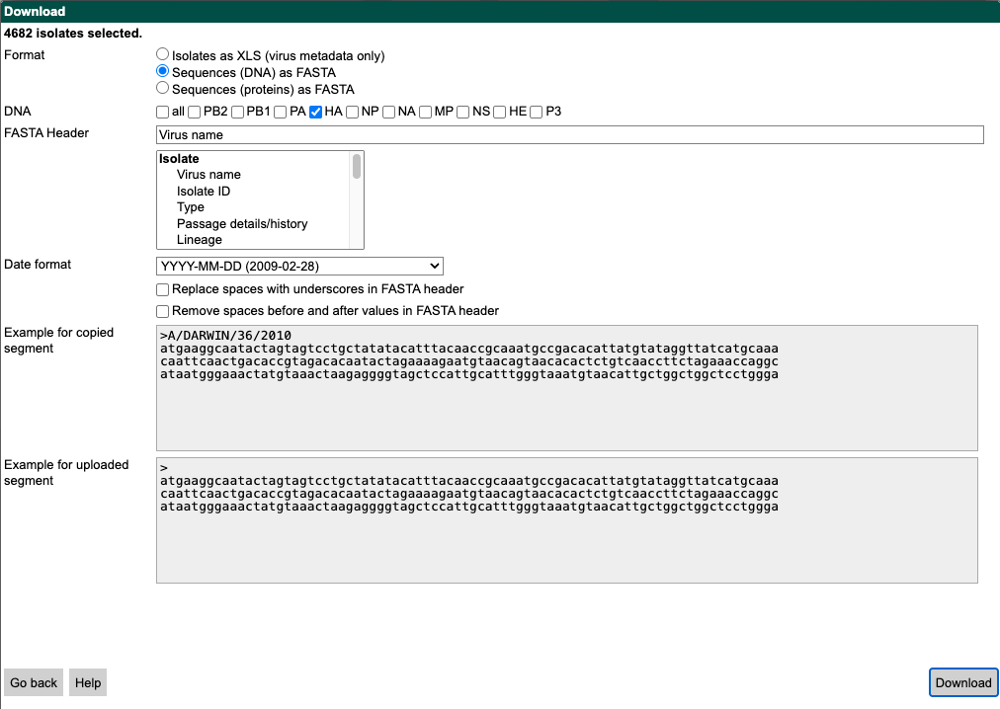
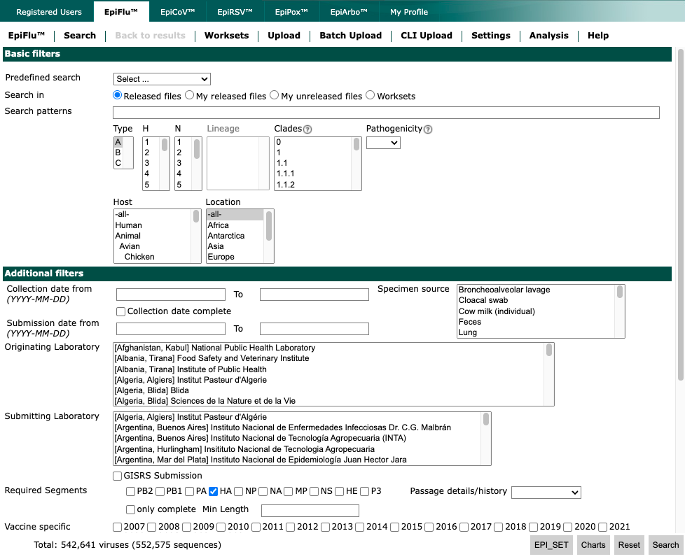
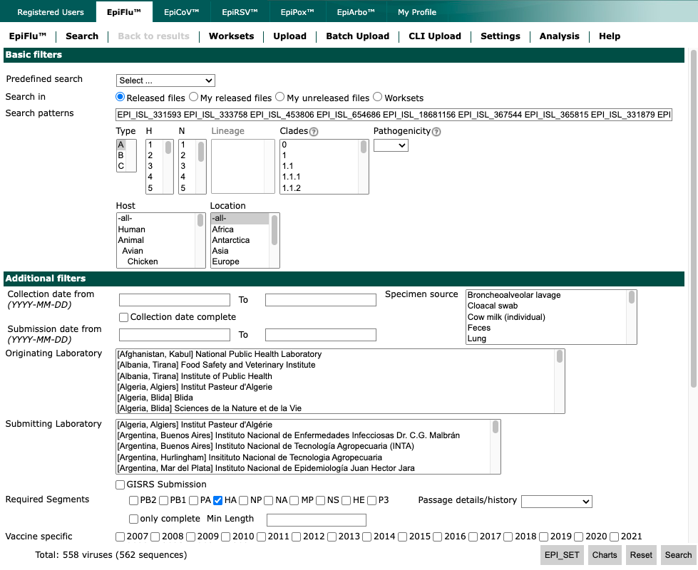
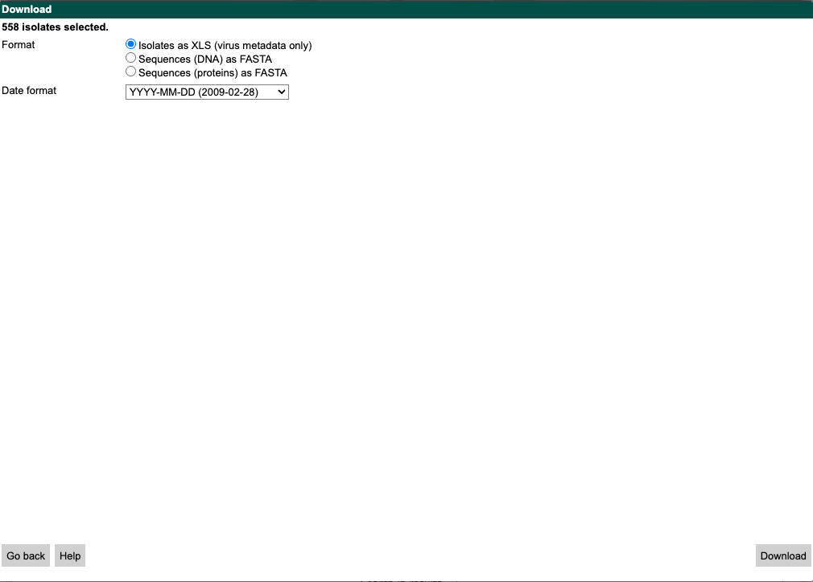
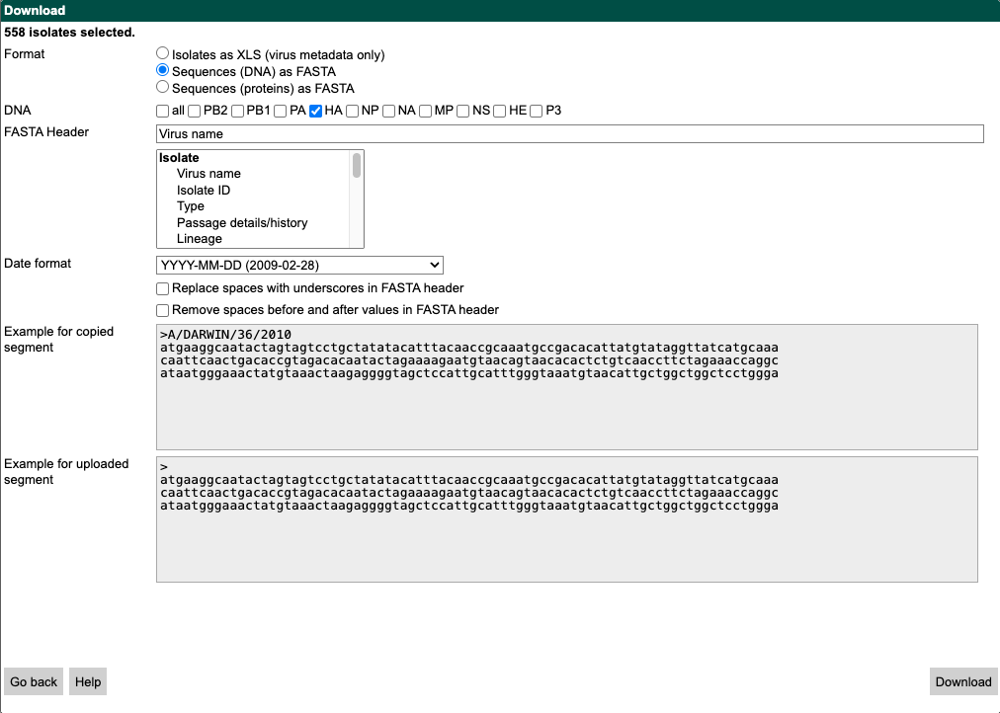

# GISAID File Custom Demo

## Assumptions, Prerequisites, and Software Install

This walkthrough assumes you have beginner knowledge of unix commands and directory navigation through command line.
If you do not, and are a Windows user, the following [tutorial](https://learn.microsoft.com/en-us/windows/wsl/tutorials/linux)
provides some of the basics.

A text editor will also be very helpful. If you do not currently have one installed or do not have a preferred editor,
[VS Code](https://code.visualstudio.com/) is excellent and free. There is also an [in-browser version of VS Code](https://vscode.dev/) if
you'd like to try it without installing.

If you are running a Windows machine you will need to install WSL (Windows Subsystem for Linux).
Follow the [install instructions provided by Microsoft](https://learn.microsoft.com/en-us/windows/wsl/install).

You must also install Nextstrain using the following [installation instructions](https://docs.nextstrain.org/en/latest/install.html).
For the **Set up a Nextstrain runtime** install section, choose the **Conda** option.

Once you have installed Nextstrain:

1. Enter into the nextstrain shell.
   ``` bash
   nextstrain shell .
   ```
2. Install the `xlrd` package.
   ``` bash
   pip install xlrd
   ```
3. Exit the nextstrain shell.
   ``` bash
   exit
   ```

This tutorial also assumes you have a [GISAID](https://gisaid.org/) account and can download data. If you do not have an account,
please obtain one through your institution.

After completing these steps successfully you will be ready to run the demo.

## Brief Nextstrain Overview

Nextstrain is an end-to-end software suite where you can process sequencing data with associated metadata to produce and view
analytic visualizations that focus around a phylogenetic tree.

Nextstrain's two primary software components are:
1. [augur](https://docs.nextstrain.org/projects/augur/en/stable/usage/usage.html) - analysis and processing toolkit
2. [auspice](https://docs.nextstrain.org/projects/auspice/en/stable/) - interactive tool for viewing phylogenomic data

Additionally, there is a stand-alone browser version of `auspice`, [`auspice.us`](https://auspice.us/). This can be
useful for private viewing of builds and associated metadata.

Behind the hood, Nextstrain uses [Snakemake](https://snakemake.readthedocs.io/en/stable/) (a workflow manager written in python)
to run build workflows with specified augur commands and overarching build YAML files. We won't be editing these files much,
but it's good to be generally aware of what components there are behind the hood.

## Demo Build Walkthrough

For this demo build we'll be following much of the [Quickstart with GISAID data section](https://github.com/nhassell/seasonal-flu-demo/tree/master?tab=readme-ov-file#quickstart-with-gisaid-data)
described in the `README.md`, we'll be doing some modifications to create a build with preferential sampling of Asia/Bangladesh and adding
in current reference viruses (reagent/genetic) for H3N2. This should give some general ideas of how to create a custom build directly from GISAID downloads.

Start by cloning this repository to a directory of your choice that is easy for you to find.

``` bash
git clone https://github.com/nhassell/seasonal-flu-demo.git
```

Navigate into the cloned directory.
``` bash
cd seasonal-flu-demo
```

### Downloading Sample Data

Create a new directory for the data we will be downloading in the `seasonal-flu-demo` working directory.

``` bash
mkdir -p data/h3n2/
```

Navigate to [GISAID](http://gisaid.org).
Select the "EpiFlu" link in the top navigation bar and then select "Search" from the EpiFlu navigation bar.
From the search interface, select A/H3N2 human samples collected in the last six months, as shown in the example below.


Make sure under the "Required Segments" section at the bottom of the page that "HA" is selected.
Then select the "Search" button.
Select the checkbox in the top-left corner of the search results (the same row with the column headings),
to select all matching records as shown below.



Select the "Download" button.
From the "Download" window that appears, select "Isolates as XLS (virus metadata only)" and then select the second "Download" button.



It may take a little while to download the information. Be patient.

Save the XLS file you downloaded (e.g., `gisaid_epiflu_isolates.xls`) in the `data/h3n2/` folder you created
earlier as `metadata.xls`.

Return to the GISAID "Download" window, and select "Sequences (DNA) as FASTA".
In the "DNA" section, select the checkbox for "HA".
In the "FASTA Header" section, enter only `Virus name`.
Leave all other sections at the default values.



Select the "Download" button.
Save the FASTA file you downloaded (e.g., `gisaid_epiflu_sequences.fasta`) as `raw_sequences_ha.fasta` in the
`data/h3n2/` folder.

### Downloading Reference Data

In order to give our builds a bit more context we will also be downloading current reference viruses for H3N2.

Navigate back to the "EpiFlu" search page and clear out all the previous search options with the exception of 
"Type" and "Required Segments".



After clearing your search copy the following epi isolate accessions and paste them into the "Search patterns"
text box.

```
EPI_ISL_331593 EPI_ISL_333758 EPI_ISL_453806 EPI_ISL_654686 EPI_ISL_18681156 EPI_ISL_367544 EPI_ISL_365815 EPI_ISL_331879 EPI_ISL_355961 EPI_ISL_377320 EPI_ISL_17054384 EPI_ISL_366478 EPI_ISL_389555 EPI_ISL_591074 EPI_ISL_15842298 EPI_ISL_345216 EPI_ISL_405960 EPI_ISL_406669 EPI_ISL_378081 EPI_ISL_403111 EPI_ISL_330893 EPI_ISL_353448 EPI_ISL_357867 EPI_ISL_397008 EPI_ISL_400750 EPI_ISL_882810 EPI_ISL_9388937 EPI_ISL_19596798 EPI_ISL_2932602 EPI_ISL_2932451 EPI_ISL_18658223 EPI_ISL_18819175 EPI_ISL_18681280 EPI_ISL_17606248 EPI_ISL_16555206 EPI_ISL_16080514 EPI_ISL_3375655 EPI_ISL_3375601 EPI_ISL_9029224 EPI_ISL_16283421 EPI_ISL_18699108 EPI_ISL_17454563 EPI_ISL_15806333 EPI_ISL_15999290 EPI_ISL_16475365 EPI_ISL_9842655 EPI_ISL_18781822 EPI_ISL_17395355 EPI_ISL_15807262 EPI_ISL_16447156 EPI_ISL_17197562 EPI_ISL_16814785 EPI_ISL_16868592 EPI_ISL_18776044 EPI_ISL_16872363 EPI_ISL_16491557 EPI_ISL_17064493 EPI_ISL_16201347 EPI_ISL_9402032 EPI_ISL_3375126 EPI_ISL_6306128 EPI_ISL_19353456 EPI_ISL_4005772 EPI_ISL_2484035 EPI_ISL_5935277 EPI_ISL_8557679 EPI_ISL_9527980 EPI_ISL_9627678 EPI_ISL_12717530 EPI_ISL_9988855 EPI_ISL_10434307 EPI_ISL_4005764 EPI_ISL_15715020 EPI_ISL_16520250 EPI_ISL_17072658 EPI_ISL_19722583 EPI_ISL_8649093 EPI_ISL_13970231 EPI_ISL_13704495 EPI_ISL_11533852 EPI_ISL_16044187 EPI_ISL_17064327 EPI_ISL_9593245 EPI_ISL_20077756 EPI_ISL_10498223 EPI_ISL_14056582 EPI_ISL_18713861 EPI_ISL_17008585 EPI_ISL_6135960 EPI_ISL_17063774 EPI_ISL_11958484 EPI_ISL_12641732 EPI_ISL_18798553 EPI_ISL_4373623 EPI_ISL_12422434 EPI_ISL_8929292 EPI_ISL_3375658 EPI_ISL_13631521 EPI_ISL_12713520 EPI_ISL_13148906 EPI_ISL_18366315 EPI_ISL_13148228 EPI_ISL_17776866 EPI_ISL_16899219 EPI_ISL_14787995 EPI_ISL_15139009 EPI_ISL_13148212 EPI_ISL_14056466 EPI_ISL_15807497 EPI_ISL_19898857 EPI_ISL_17784088 EPI_ISL_17776954 EPI_ISL_9847620 EPI_ISL_19722542 EPI_ISL_16995100 EPI_ISL_16749921 EPI_ISL_18742501 EPI_ISL_18130609 EPI_ISL_12942936 EPI_ISL_5419100 EPI_ISL_18167526 EPI_ISL_13812241 EPI_ISL_15928847 EPI_ISL_15929503 EPI_ISL_16837159 EPI_ISL_18143022 EPI_ISL_19355079 EPI_ISL_19737970 EPI_ISL_19050740 EPI_ISL_18828279 EPI_ISL_19176222 EPI_ISL_18531365 EPI_ISL_18592324 EPI_ISL_17395356 EPI_ISL_19285511 EPI_ISL_18100547 EPI_ISL_19773887 EPI_ISL_18543870 EPI_ISL_19849480 EPI_ISL_19031609 EPI_ISL_17981158 EPI_ISL_16270208 EPI_ISL_19844001 EPI_ISL_17064341 EPI_ISL_19722570 EPI_ISL_18699118 EPI_ISL_18138340 EPI_ISL_18660328 EPI_ISL_17559577 EPI_ISL_18828522 EPI_ISL_18884762 EPI_ISL_18660345 EPI_ISL_19530487 EPI_ISL_20150126 EPI_ISL_17150677 EPI_ISL_19089842 EPI_ISL_18738304 EPI_ISL_19283594 EPI_ISL_18215655 EPI_ISL_18849869 EPI_ISL_18737807 EPI_ISL_18543854 EPI_ISL_18586451 EPI_ISL_19899602 EPI_ISL_19854893 EPI_ISL_19631315 EPI_ISL_19883062 EPI_ISL_19816693 EPI_ISL_19767504 EPI_ISL_16616057 EPI_ISL_18516504 EPI_ISL_17064492 EPI_ISL_19330629 EPI_ISL_18613485 EPI_ISL_19762370 EPI_ISL_18781189 EPI_ISL_19798828 EPI_ISL_19462358 EPI_ISL_19522932 EPI_ISL_20070574 EPI_ISL_20125596 EPI_ISL_19814761 EPI_ISL_19539052 EPI_ISL_20078862 EPI_ISL_20103064 EPI_ISL_20070771 EPI_ISL_19878442 EPI_ISL_19822602 EPI_ISL_19874913 EPI_ISL_19882536 EPI_ISL_19867026 EPI_ISL_19904878 EPI_ISL_20098028 EPI_ISL_19814750 EPI_ISL_20058078 EPI_ISL_20066544 EPI_ISL_19767422 EPI_ISL_19891088 EPI_ISL_19854221 EPI_ISL_19762225 EPI_ISL_19326419 EPI_ISL_19844093 EPI_ISL_19818782 EPI_ISL_20046949 EPI_ISL_19826074 EPI_ISL_19825950 EPI_ISL_19826082 EPI_ISL_20090947 EPI_ISL_20103059 EPI_ISL_20092188 EPI_ISL_19831897 EPI_ISL_19817868 EPI_ISL_20073417 EPI_ISL_20138808 EPI_ISL_19557980 EPI_ISL_19817776 EPI_ISL_20087531 EPI_ISL_19330624 EPI_ISL_19725587 EPI_ISL_20072713 EPI_ISL_20097264 EPI_ISL_19900506 EPI_ISL_19333829 EPI_ISL_19522869 EPI_ISL_19834767 EPI_ISL_19874974 EPI_ISL_19805874 EPI_ISL_19881393 EPI_ISL_18660123 EPI_ISL_19217248 EPI_ISL_19622325 EPI_ISL_19862370 EPI_ISL_20067687 EPI_ISL_19862418 EPI_ISL_19003240 EPI_ISL_19783766 EPI_ISL_19822180 EPI_ISL_20075731 EPI_ISL_19843720 EPI_ISL_20069410 EPI_ISL_19855278 EPI_ISL_19545313 EPI_ISL_19672762 EPI_ISL_20144308 EPI_ISL_20144313 EPI_ISL_19862373 EPI_ISL_19056395 EPI_ISL_19813561 EPI_ISL_19834756 EPI_ISL_19883269 EPI_ISL_20069549 EPI_ISL_20061928 EPI_ISL_19480734 EPI_ISL_20069472 EPI_ISL_20078938 EPI_ISL_19834573 EPI_ISL_19695689 EPI_ISL_19862397 EPI_ISL_19817786 EPI_ISL_19873121 EPI_ISL_20055799 EPI_ISL_19912357 EPI_ISL_19862909 EPI_ISL_19852655 EPI_ISL_19636270 EPI_ISL_20078981 EPI_ISL_19823616 EPI_ISL_19850527 EPI_ISL_19863026 EPI_ISL_20087282 EPI_ISL_19500593 EPI_ISL_20065411 EPI_ISL_19214916 EPI_ISL_19826194 EPI_ISL_19904904 EPI_ISL_19880474 EPI_ISL_19905147 EPI_ISL_19084585 EPI_ISL_19689147 EPI_ISL_20140890 EPI_ISL_19889243 EPI_ISL_19806063 EPI_ISL_19854280 EPI_ISL_20097052 EPI_ISL_20049400 EPI_ISL_19896251 EPI_ISL_20099486 EPI_ISL_19874999 EPI_ISL_20136662 EPI_ISL_19816852 EPI_ISL_19711523 EPI_ISL_19642616 EPI_ISL_20125588 EPI_ISL_20141855 EPI_ISL_20123755 EPI_ISL_19850570 EPI_ISL_19429485 EPI_ISL_19818136 EPI_ISL_19834837 EPI_ISL_19649892 EPI_ISL_19407664 EPI_ISL_19500658 EPI_ISL_18969065 EPI_ISL_19822271 EPI_ISL_19855266 EPI_ISL_20069894 EPI_ISL_19484593 EPI_ISL_20046943 EPI_ISL_20071238 EPI_ISL_20068186 EPI_ISL_20141007 EPI_ISL_20136373 EPI_ISL_20136376 EPI_ISL_19893760 EPI_ISL_20135313 EPI_ISL_19895794 EPI_ISL_20079706 EPI_ISL_18991187 EPI_ISL_19322649 EPI_ISL_19572461 EPI_ISL_19678115 EPI_ISL_19056184 EPI_ISL_18894272 EPI_ISL_19450663 EPI_ISL_19407881 EPI_ISL_20074616 EPI_ISL_19466957 EPI_ISL_19855164 EPI_ISL_20141037 EPI_ISL_19874868 EPI_ISL_19021289 EPI_ISL_20084015 EPI_ISL_20081922 EPI_ISL_20049350 EPI_ISL_19747709 EPI_ISL_18885800 EPI_ISL_18926404 EPI_ISL_19011449 EPI_ISL_18739141 EPI_ISL_19766896 EPI_ISL_18989374 EPI_ISL_19817864 EPI_ISL_19899587 EPI_ISL_19826067 EPI_ISL_20111146 EPI_ISL_20050346 EPI_ISL_19883059 EPI_ISL_19781088 EPI_ISL_18837743 EPI_ISL_19169243 EPI_ISL_18768249 EPI_ISL_18781183 EPI_ISL_19904839 EPI_ISL_19383449 EPI_ISL_19596020 EPI_ISL_18969055 EPI_ISL_18864644 EPI_ISL_19767468 EPI_ISL_19891070 EPI_ISL_19787012 EPI_ISL_19853069 EPI_ISL_19902043 EPI_ISL_19689668 EPI_ISL_18876718 EPI_ISL_19810246 EPI_ISL_19767554 EPI_ISL_19940299 EPI_ISL_20150132 EPI_ISL_20054169 EPI_ISL_19824145 EPI_ISL_19862200 EPI_ISL_20092379 EPI_ISL_20131558 EPI_ISL_19873747 EPI_ISL_19812260 EPI_ISL_18739092 EPI_ISL_18862343 EPI_ISL_19905193 EPI_ISL_19407912 EPI_ISL_19386876 EPI_ISL_19173800 EPI_ISL_19268918 EPI_ISL_19814478 EPI_ISL_18962470 EPI_ISL_19333477 EPI_ISL_19530380 EPI_ISL_19871359 EPI_ISL_19083237 EPI_ISL_19856609 EPI_ISL_19774152 EPI_ISL_19383463 EPI_ISL_18754194 EPI_ISL_19885728 EPI_ISL_19478175 EPI_ISL_18864710 EPI_ISL_19571861 EPI_ISL_19669126 EPI_ISL_19843780 EPI_ISL_20061905 EPI_ISL_19883271 EPI_ISL_20071175 EPI_ISL_18885965 EPI_ISL_18737912 EPI_ISL_19160564 EPI_ISL_19727544 EPI_ISL_19852604 EPI_ISL_19798822 EPI_ISL_19856578 EPI_ISL_20071121 EPI_ISL_19843774 EPI_ISL_20141605 EPI_ISL_18794546 EPI_ISL_18802255 EPI_ISL_19899593 EPI_ISL_20151198 EPI_ISL_19445310 EPI_ISL_19586921 EPI_ISL_19904995 EPI_ISL_19847174 EPI_ISL_19899630 EPI_ISL_19881038 EPI_ISL_19881897 EPI_ISL_19874760 EPI_ISL_20074617 EPI_ISL_19196949 EPI_ISL_19887878 EPI_ISL_19727489 EPI_ISL_20072808 EPI_ISL_19866190 EPI_ISL_19871363 EPI_ISL_19776829 EPI_ISL_19814786 EPI_ISL_19821704 EPI_ISL_20131565 EPI_ISL_19887912 EPI_ISL_6306633 EPI_ISL_20077103 EPI_ISL_16864398 EPI_ISL_20105158 EPI_ISL_19194107 EPI_ISL_20099689 EPI_ISL_19599342 EPI_ISL_18613791 EPI_ISL_18406536 EPI_ISL_19727623 EPI_ISL_18666943 EPI_ISL_15724431 EPI_ISL_19267370 EPI_ISL_18798261 EPI_ISL_19558648 EPI_ISL_19445342 EPI_ISL_19844013 EPI_ISL_20077104 EPI_ISL_19377014 EPI_ISL_19676565 EPI_ISL_19789935 EPI_ISL_18068808 EPI_ISL_19175850 EPI_ISL_19727739 EPI_ISL_18543831 EPI_ISL_18856681 EPI_ISL_19778273 EPI_ISL_17801747 EPI_ISL_13655506 EPI_ISL_18613879 EPI_ISL_20077105 EPI_ISL_19296586 EPI_ISL_19322622 EPI_ISL_16947044 EPI_ISL_19789925 EPI_ISL_20070512 EPI_ISL_17465772 EPI_ISL_18604311 EPI_ISL_19574629 EPI_ISL_19119395 EPI_ISL_18919792 EPI_ISL_18666931 EPI_ISL_17832071 EPI_ISL_18613797 EPI_ISL_3534319 EPI_ISL_20099654 EPI_ISL_19074216 EPI_ISL_19727736 EPI_ISL_19030763 EPI_ISL_19825839 EPI_ISL_18864876 EPI_ISL_19814852 EPI_ISL_17212772 EPI_ISL_19486897 EPI_ISL_19823114 EPI_ISL_4059596 EPI_ISL_18486188 EPI_ISL_14333098 EPI_ISL_18485082 EPI_ISL_20099501 EPI_ISL_19194678 EPI_ISL_19085723 EPI_ISL_19315832 EPI_ISL_20077106 EPI_ISL_19296590 EPI_ISL_18666872 EPI_ISL_19377020 EPI_ISL_19857393 EPI_ISL_20077102 EPI_ISL_18604205 EPI_ISL_19025388 EPI_ISL_19810282 EPI_ISL_20102307 EPI_ISL_17063686 EPI_ISL_18853720 EPI_ISL_20099496 EPI_ISL_19633755 EPI_ISL_20077409 EPI_ISL_19252711 EPI_ISL_19871657 EPI_ISL_18857248 EPI_ISL_19685668 EPI_ISL_18604225 EPI_ISL_19377025 EPI_ISL_19727620 EPI_ISL_18068789 EPI_ISL_12713450 EPI_ISL_19301943 EPI_ISL_20099658 EPI_ISL_18584697 EPI_ISL_19727617 EPI_ISL_19727730 EPI_ISL_20138709 EPI_ISL_19175843 EPI_ISL_17465769 EPI_ISL_18799560 EPI_ISL_16613698 EPI_ISL_19025387 EPI_ISL_20077410 EPI_ISL_16968012 EPI_ISL_19201091 EPI_ISL_19437599 EPI_ISL_18962457 EPI_ISL_20066834 EPI_ISL_19789934 EPI_ISL_18799166 EPI_ISL_19321959 EPI_ISL_18962528 EPI_ISL_19338062 EPI_ISL_18870832 EPI_ISL_18812000 EPI_ISL_19767812 EPI_ISL_19085879 EPI_ISL_18666938 EPI_ISL_17465773 EPI_ISL_19711425 EPI_ISL_19855288 EPI_ISL_18485122 EPI_ISL_20102306 EPI_ISL_20144555 EPI_ISL_19291223 EPI_ISL_18543862 EPI_ISL_18949958 EPI_ISL_19727733 EPI_ISL_19871656 EPI_ISL_19789931 EPI_ISL_19382090 EPI_ISL_18744435 EPI_ISL_20144546 EPI_ISL_14115546 EPI_ISL_18604240
```



You should see **558** viruses in total.
Select the "Search" button. Select all with the top-left corner checkbox.
Select the "Download" button.
From the "Download" window that appears, select "Isolates as XLS (virus metadata only)" and then select the second "Download" button.



Save the XLS file you downloaded (e.g., `gisaid_epiflu_isolates.xls (1)`) as `references.xls` in the `data/h3n2/` folder.

Return to the GISAID "Download" window, and select "Sequences (DNA) as FASTA".
In the "DNA" section, select the checkbox for "HA".
In the "FASTA Header" section, enter only `Isolate name`.
Leave all other sections at the default values.



Select the "Download" button.
Save the FASTA file you downloaded (e.g., `gisaid_epiflu_sequences.fasta (1)`) as `references_ha.fasta` in the `data/h3n2/` folder.

### Running the Custom Workflow

Run the Nextstrain workflow for these data to produce an annotated phylogenetic tree of recent A/H3N2 HA data with the following command.

``` bash
nextstrain build . --configfile profiles/gisaid/custom_gisaid.yaml
```

You will see all the "rules" of the Snakemake workflow executing and the direct commands for each rule as the process executes.
This process takes the raw data, cleans/transforms it, aligns it to the appropriate reference frame using nextalign, generates
a phylogenetic tree using [IQ-TREE](http://www.iqtree.org/), estimates a time-scaled phylogeny using [treetime](https://github.com/neherlab/treetime),
along with many other steps to produce the build JSON files.

When the workflow finishes running, visualize the resulting tree with the following command by doing one of the following:

   1. Execute the following command:
      ``` bash
      nextstrain view auspice
      ```
   2. Navigate to the `auspice/` folder and drap/drop the two `.json` files into [auspice.us](https://auspice.us/)

Option `1.` will run `auspice` locally on your computer and launch the build in browser. Option `2.` uses 
[auspice.us](https://auspice.us/) which can be useful if you run into any issues launching auspice locally or want to share 
the build with someone who does not have Nextstrain installed.

This is all well and good, but what was changed from the default gisaid build profile to generate this custom build?

### Build Customization

Build customization used to be a much more arduous process where one needed to understand how and where to modify the 
rules within the Snakemake files. However, nextstrain has made much of this process easier by implementing 
a lot of pre-configuration and higher level controls within simplified 
[workflow config files](https://docs.nextstrain.org/projects/ncov/en/latest/guides/workflow-config-file.html)
written in [YAML](https://yaml.org/).

The workflow config is the main file to modify workflow execution and sampling. For our build this was the file `profiles/gisaid/custom_gisaid.yaml`.

Take a look at the file contents of `profiles/gisaid/custom_gisaid.yaml` compared to `profiles/gisaid/builds.yaml`.

Much of it has remained the same, but there are several changes.

First, we have changed the `custom_rules` definition.
``` yaml
custom_rules:
  - profiles/gisaid/prepare_data_wrefs.smk
```

Take a quick look at the file `profiles/gisaid/prepare_data_wrefs.smk` compared to `profiles/gisaid/prepare_data.smk`.
Code execution has been added to the `shell` portions of these rules to download the most current clade/subclade information,
process the reference data we downloaded, and concatenate it with the sample data.

Second, we've changed the `auspice_config` definition.
``` yaml
      auspice_config: "config/h3n2/auspice_config_custom.json"
```

The build config now refers to a customized JSON configuration where we've edited the build title and contact information.

Third, we've added the `root` and `include` definition.
``` yaml
      root: A/Norway/3288/2018
      include: "config/h3n2/ha/cdc_reference_strains.txt"
```

This sets `A/Norway/3288/2018` as the root from our reference metadata and defines an inclusion file location for all of our
references we would like to force to be included. This file (`config/h3n2/ha/cdc_reference_strains.txt`) is a list of the
references `strain` field definition from our metadata.

Lastly, we have altered the `subsamples` definition.
``` yaml
      subsamples: # Can modify these subsampling schemes or add your own
        global:
            filters: "--group-by country year month --subsample-max-sequences 100 --include {include} --exclude-where 'region=asia'"
        asia:
            filters: "--group-by country year month --subsample-max-sequences 150 --include {include} --exclude-where 'region!=asia'"
        vietnam:
            filters: "--group-by division year month --subsample-max-sequences 200 --include {include} --exclude-where 'country!=bangladesh'"
```

This changes our sub-sampling to contain three sub-sampling strategies that can be altered individually.
Our `global` sampling samples by country, year and month excluding the asia region.
Our `asia` sampling samples by country, year, and month only from asia.
Our `bangladesh` sampling samples by division, year, and month only from Bangladesh.

All sub-sampling strategies have the `--include {include}` flag so our file defined by `include` is passed to keep our reference strains.

Explore the other configuration files in `profiles/`, to see examples of how you can build more complex Nextstrain workflows for influenza.

### Bonus: Adding Extra (or Sensitive) Data

If you need to add extra (or sensitive) data to your build that needs to be kept separate, this can be done within a
CSV/TSV/XLSX file. Follow the [guide provided by Nextstrain for more in-depth details](https://docs.nextstrain.org/projects/auspice/en/stable/advanced-functionality/drag-drop-csv-tsv.html).

There is an example file (`profiles/gisaid/secrets.tsv`) included in this repo that you can drag/drop onto the demo build.

This will create a custom coloration category of `secret` generated by random assignment. Take a peek at the file itself if you want to 
replicate something similar for a data category of your own.

### Notes on potential user future custom builds

> [!IMPORTANT]
> The workflow is optimized for HA and NA segments and requires additional files if you are building other segments!

- The following files are required for different lineage and segment builds:
  - reference: "config/{lineage}/{segment}/reference.fasta"
  - annotation: "config/{lineage}/{segment}/genemap.gff"
  - tree_exclude_sites: "config/{lineage}/{segment}/exclude-sites.txt"
- The workflow assigns clade annotations to non-HA segments from HA, so the
`clades` configuration should always point to the HA clade definition TSV.
- The workflow only has subclade annotations for HA and NA segments, so remove
the `subclades` configuration for other segments builds.
