# GISAID File Custom Demo

## Assumptions, Prerequisites, and Software Install

This walkthrough assumes you have beginner knowledge of unix commands and directory navigation through command line.
If you do not, and are a Windows user, the following [tutorial](https://learn.microsoft.com/en-us/windows/wsl/tutorials/linux)
provides some of the basics.

A text editor will also be very helpful. If you do not currently have one installed or do not have a preferred editor,
[VS Code](https://code.visualstudio.com/) is excellent and free. There is also an [in-browser version of VS Code](https://vscode.dev/) if
you'd like to try it without installing.

If you are running a Windows machine you will need to install WSL (Windows Subsystem for Linux).
Follow the [install instructions provided by Microsoft](https://learn.microsoft.com/en-us/windows/wsl/install).

You must also install Nextstrain using the following [installation instructions](https://docs.nextstrain.org/en/latest/install.html).
For the **Set up a Nextstrain runtime** install section, choose the **Conda** option.

Once you have installed Nextstrain:

1. Enter into the nextstrain shell.
   ``` bash
   nextstrain shell .
   ```
2. Install the `xlrd` package.
   ``` bash
   pip install xlrd
   ```
3. Exit the nextstrain shell.
   ``` bash
   exit
   ```

This tutorial also assumes you have a [GISAID](https://gisaid.org/) account and can download data. If you do not have an account,
please obtain one through your institution.

After completing these steps successfully you will be ready to run the demo.

## Brief Nextstrain Overview

Nextstrain is an end-to-end software suite where you can process sequencing data with associated metadata to produce and view
analytic visualizations that focus around a phylogenetic tree.

Nextstrain's two primary software components are:
1. [augur](https://docs.nextstrain.org/projects/augur/en/stable/usage/usage.html) - analysis and processing toolkit
2. [auspice](https://docs.nextstrain.org/projects/auspice/en/stable/) - interactive tool for viewing phylogenomic data

Additionally, there is a stand-alone browser version of `auspice`, [`auspice.us`](https://auspice.us/). This can be
useful for private viewing of builds and associated metadata.

Behind the hood, Nextstrain uses [Snakemake](https://snakemake.readthedocs.io/en/stable/) (a workflow manager written in python)
to run build workflows with specified augur commands and overarching build YAML files. We won't be editing these files much,
but it's good to be generally aware of what components there are behind the hood.

## Demo Build Walkthrough

For this demo build we'll be following much of the [Quickstart with GISAID data section](https://github.com/nhassell/seasonal-flu-demo/tree/master?tab=readme-ov-file#quickstart-with-gisaid-data)
described in the `README.md`, we'll be doing some modifications to create a build with preferential sampling of Oceania/Australia and adding
in current reference viruses (reagent/genetic) for H3N2. This should give some general ideas of how to create a custom build directly from GISAID downloads.

Start by cloning this repository to a directory of your choice that is easy for you to find.

``` bash
git clone https://github.com/nhassell/seasonal-flu-demo.git
```

Navigate into the cloned directory.
``` bash
cd seasonal-flu-demo
```
### Downloading Sample Data

Create a new directory for the data we will be downloading in the `seasonal-flu-demo` working directory.
The workflow organises data by segment first, then lineage, so HA and NA builds do not overwrite each other.

``` bash
mkdir -p data/ha/h3n2/
```

Navigate to [GISAID](http://gisaid.org).
Select the "EpiFlu" link in the top navigation bar and then select "Search" from the EpiFlu navigation bar.
From the search interface, select A/H3N2 human samples collected from `2025-07-01` to `2025-10-31`, as shown in the example below.
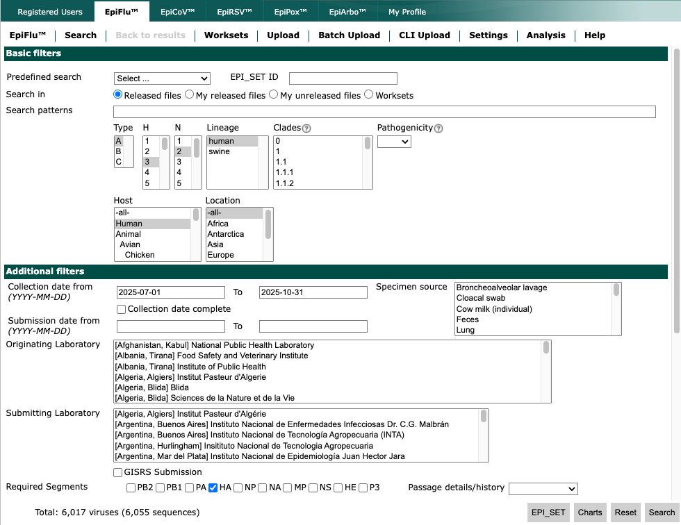

Make sure under the "Required Segments" section at the bottom of the page that "HA" is selected.
Then select the "Search" button.
Select the checkbox in the top-left corner of the search results (the same row with the column headings),
to select all matching records as shown below.

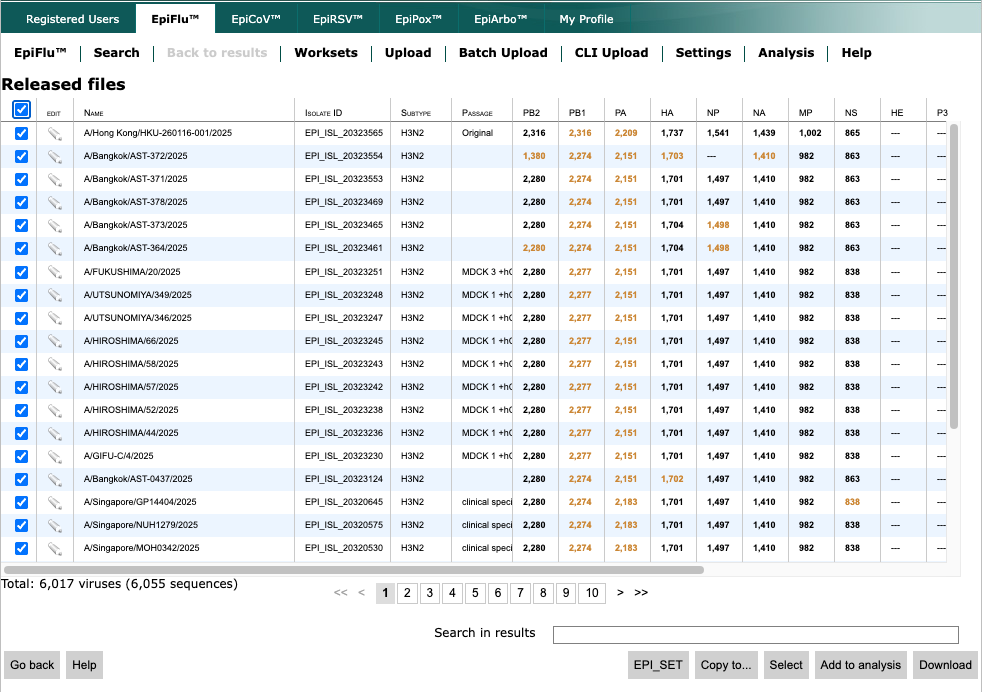

Select the "Download" button.
From the "Download" window that appears, select "Isolates as XLS (virus metadata only)" and then select the second "Download" button.

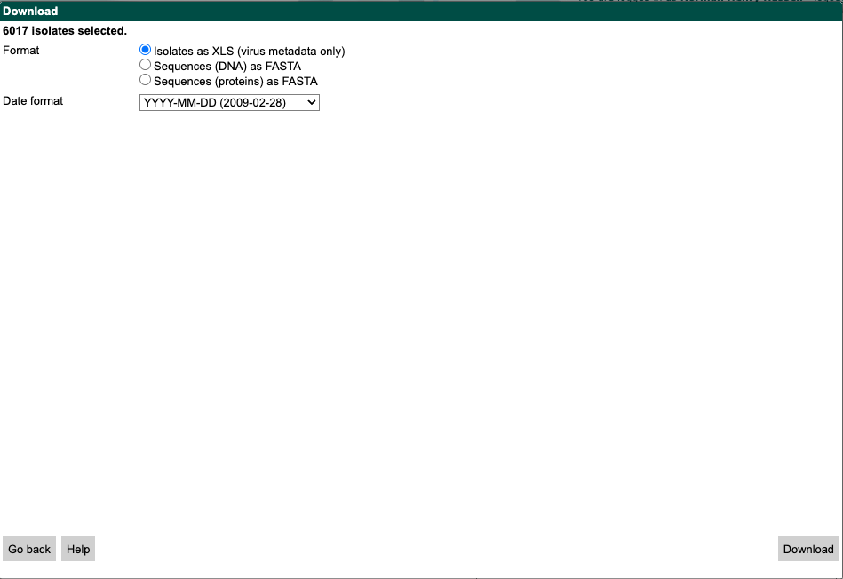

It may take a little while to download the information. Be patient.

Save the XLS file you downloaded (e.g., `gisaid_epiflu_isolates.xls`) in the `data/ha/h3n2/` folder you created
earlier as `metadata.xls`.

Return to the GISAID "Download" window, and select "Sequences (DNA) as FASTA".
In the "DNA" section, select the checkbox for "HA".
In the "FASTA Header" section, enter only `Virus name`.
Leave all other sections at the default values.

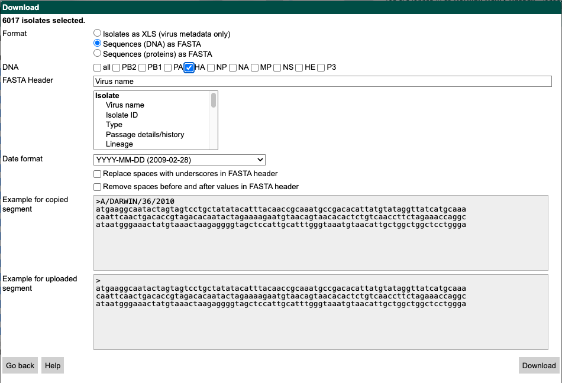

Select the "Download" button.
Save the FASTA file you downloaded (e.g., `gisaid_epiflu_sequences.fasta`) as `raw_sequences_ha.fasta` in the
`data/ha/h3n2/` folder.

### Downloading Reference Data

In order to give our builds a bit more context we will also be downloading two sets of reference viruses for H3N2.
One will be a set of genetic references, meant to give a backbone to the tree structure. Another will be a set of
reagent references, which are representative viruses used within antigenic tests as sera.

#### Genetic Reference Download
Navigate back to the "EpiFlu" search page and clear out all the previous search options with the exception of 
"Type" and "Required Segments".

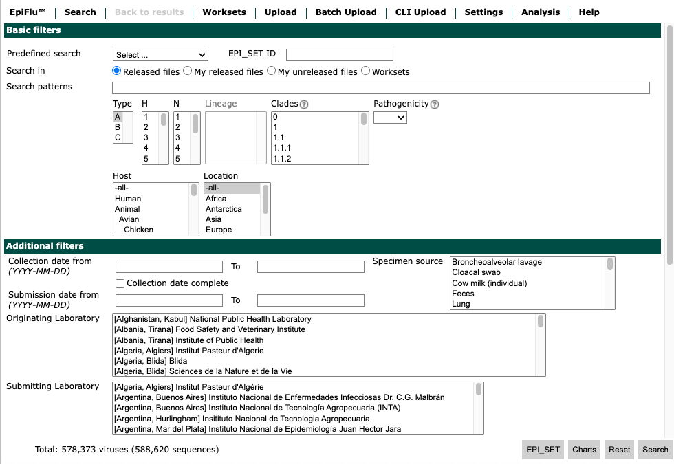

After clearing your search copy the following EPI_SET accession and paste it into the "EPI_SET ID"
text box.

```
EPI_SET_260113zr
```

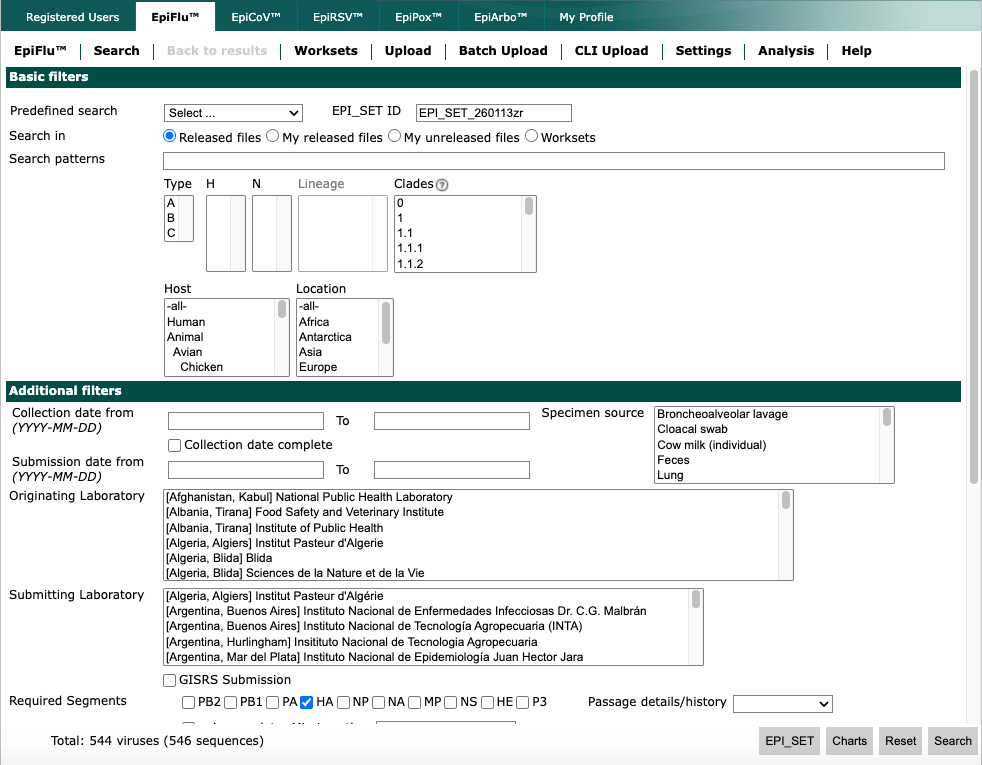

You should see **544** viruses in total.
Select the "Search" button. Select all with the top-left corner checkbox.
Select the "Download" button.
From the "Download" window that appears, select "Isolates as XLS (virus metadata only)" and then select the second "Download" button.

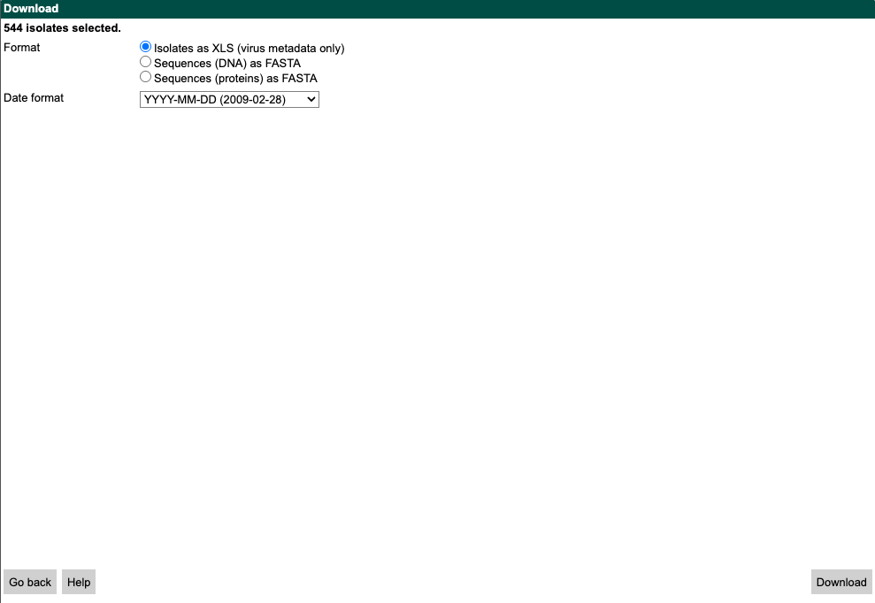

Copy the XLS file you downloaded (e.g., `gisaid_epiflu_isolates.xls (1)`) as `genetic.xls` in the `data/ha/h3n2/` folder.

Return to the GISAID "Download" window, and select "Sequences (DNA) as FASTA".
In the "DNA" section, select the checkbox for "HA".
In the "FASTA Header" section, copy the following:

```
Virus name
```

Leave all other sections at the default values.

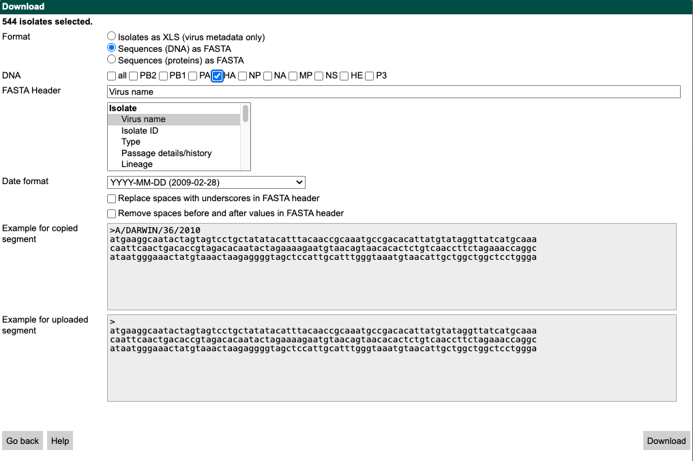

Select the "Download" button.
Save the FASTA file you downloaded (e.g., `gisaid_epiflu_sequences.fasta (1)`) as `genetic_ha.fasta` in the `data/ha/h3n2/` folder.

#### Reagent Reference Download

Navigate again back to the "EpiFlu" search page and clear out all the previous search options with the exception of 
"Type" and "Required Segments".


After clearing your search copy the following EPI_SET accession and paste it into the "EPI_SET ID"
text box.

```
EPI_SET_260226fx
```

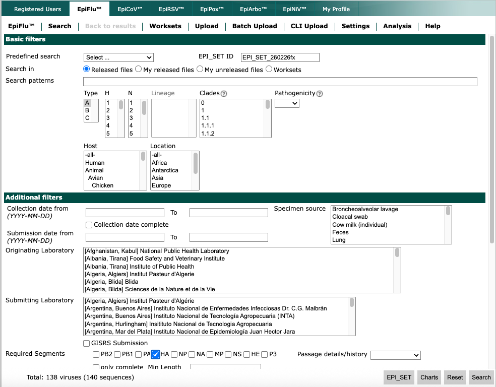

You should see **138** viruses in total.
Select the "Search" button. Select all with the top-left corner checkbox.
Select the "Download" button.
From the "Download" window that appears, select "Isolates as XLS (virus metadata only)" and then select the second "Download" button.

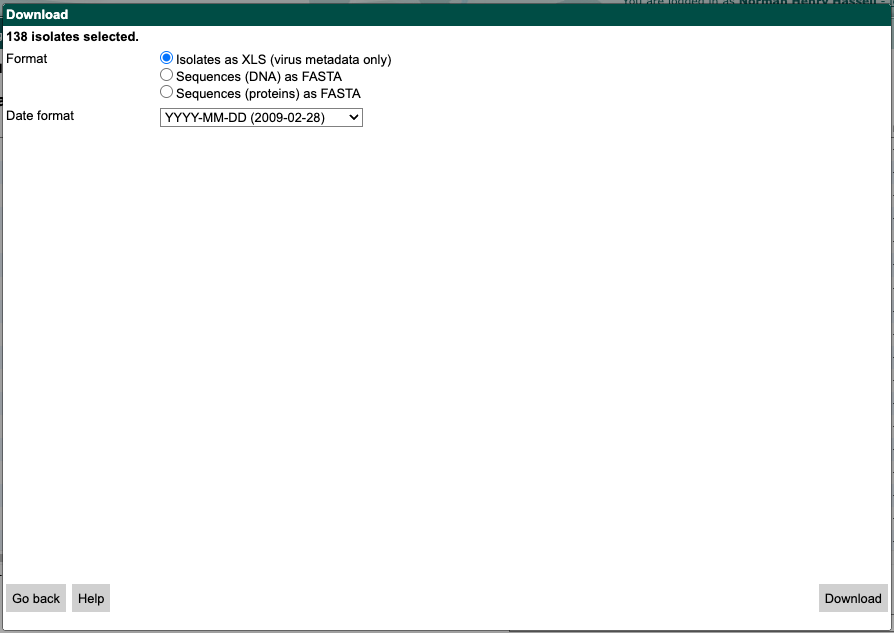

Copy the XLS file you downloaded (e.g., `gisaid_epiflu_isolates.xls (2)`) and rename as `reagent.xls` in the `data/ha/h3n2/` folder.

Return to the GISAID "Download" window, and select "Sequences (DNA) as FASTA".
In the "DNA" section, select the checkbox for "HA".
In the "FASTA Header" section, copy the following:

```
Virus name_Passage details/history
```

Leave all other sections at the default values.

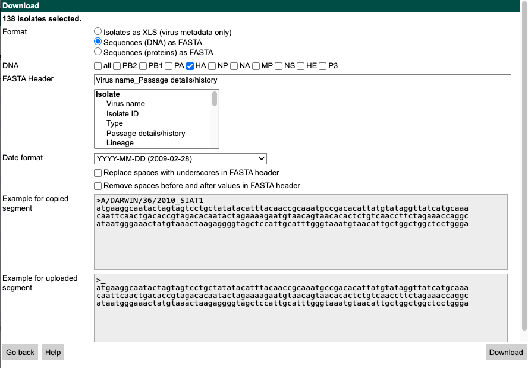

Select the "Download" button.
Copy the FASTA file you downloaded (e.g., `gisaid_epiflu_sequences.fasta (2)`) as `reagent_ha.fasta` in the `data/ha/h3n2/` folder.

### Customizing Basic Build Elements

For builds, page text and build component configuration are hosted within config JSONs. This builds config file is located at:

```
config/h3n2/ha/auspice_config_custom.json
```

Open the file and edit the `name` and `url` fields in the `maintainers` section to your name and GitHub home page url.

```
{
  "title": "Real-time tracking of influenza A/H3N2 evolution - Custom focused subsampling",
  "maintainers": [
    {"name": "Norman Hassell", "url": "https://github.com/nhassell"}
  ],
```

If you look further down at the JSON file, you'll see several other components. These include:

- `build_url`: the url hosting your build code.
- `colorings`: the colorings of your build, you can add/subtract components of coloring available from elements of your provided metadata.
- `geo_resolutions`: geographic you want to make available for your build.
- `display_defaults`: options for the auspice viewer display defaults for your build.
- `filters`: fields from your metadata you would like to make available for clickable text filters.
- `panels`: the display panels you would lke available.

See the [Nextstrain documentation](https://docs.nextstrain.org/projects/auspice/en/stable/advanced-functionality/view-settings.html) on this
for more details.

We'll leave the rest of these options unchanged, as the defaults are appropriate for the analysis we are making.

### Running the Custom Workflow

Run the Nextstrain workflow for these data to produce an annotated phylogenetic tree of recent A/H3N2 HA data with the following command.

``` bash
nextstrain build . --configfile profiles/gisaid/custom_gisaid.yaml
```

You will see all the "rules" of the Snakemake workflow executing and the direct commands for each rule as the process executes.
This process takes the raw data, cleans/transforms it, aligns it to the appropriate reference frame using nextalign, generates
a phylogenetic tree using [IQ-TREE](http://www.iqtree.org/), estimates a time-scaled phylogeny using [treetime](https://github.com/neherlab/treetime),
along with many other steps to produce the build JSON files.

When the workflow finishes running, visualize the resulting tree with the following command by doing one of the following:

   1. Execute the following command:
      ``` bash
      nextstrain view auspice
      ```
   2. Navigate to the `auspice/` folder and drap/drop the two `.json` files into [auspice.us](https://auspice.us/)

Option `1.` will run `auspice` locally on your computer and launch the build in browser. Option `2.` uses 
[auspice.us](https://auspice.us/) which can be useful if you run into any issues launching auspice locally or want to share 
the build with someone who does not have Nextstrain installed.

This is all well and good, but what was changed from the default gisaid build profile to generate this custom build?

### Build Customization

Build customization used to be a much more arduous process where one needed to understand how and where to modify the 
rules within the Snakemake files. However, nextstrain has made much of this process easier by implementing 
a lot of pre-configuration and higher level controls within simplified 
[workflow config files](https://docs.nextstrain.org/projects/ncov/en/latest/guides/workflow-config-file.html)
written in [YAML](https://yaml.org/).

The workflow config is the main file to modify workflow execution and sampling. For our build this was the file `profiles/gisaid/custom_gisaid.yaml`.

Take a look at the file contents of `profiles/gisaid/custom_gisaid.yaml` compared to `profiles/gisaid/builds.yaml`.

Much of it has remained the same, but there are several changes.

First, we have changed the `custom_rules` definition and added `data_per_segment`.
``` yaml
custom_rules:
  - profiles/gisaid/prepare_data_wrefs.smk

data_per_segment: true
```

Take a quick look at the file `profiles/gisaid/prepare_data_wrefs.smk` compared to `profiles/gisaid/prepare_data.smk`.
Code execution has been added to the `shell` portions of these rules to download the most current clade/subclade information,
process the reference data we downloaded, and concatenate it with the sample data.

Setting `data_per_segment: true` tells the workflow to look for input data under `data/{segment}/{lineage}/`
(e.g. `data/ha/h3n2/`) instead of the legacy `data/{lineage}/` layout. This allows HA and NA builds for the
same lineage to coexist without overwriting each other's files.

Second, we've changed the `auspice_config` definition.
``` yaml
      auspice_config: "config/h3n2/ha/auspice_config_custom.json"
```

The build config now refers to a customized JSON configuration where we've edited the build title and contact information.

Third, we've added the `root`, `include`, and `min_date` definitions.
``` yaml
      root: A/Norway/3288/2018
      include: "config/h3n2/ha/reference_strains.txt"
      min_date: "2025-01-01"
```

This sets `A/Norway/3288/2018` as the root from our reference metadata, defines an inclusion file location for all of our
references we would like to force to be included, and sets a minimum sampling date of `2025-01-01`. The file
`config/h3n2/ha/reference_strains.txt` is **automatically generated** by the workflow's `prepare_sequences` step
from the strain names in the genetic and reagent metadata you downloaded — you do not need to create or edit it manually.

Lastly, we have altered the `subsamples` definition.
``` yaml
      subsamples: # Can modify these subsampling schemes or add your own
        global:
          filters: "--min-date {min_date} --group-by country year month --subsample-max-sequences 150 --include {include} --exclude-where 'region=oceania'"
        oceania:
          filters: "--min-date {min_date} --group-by country year month --subsample-max-sequences 100 --include {include} --exclude-where 'region!=oceania'"
        australia:
          filters: "--min-date {min_date} --group-by division year month --subsample-max-sequences 200 --include {include} --exclude-where 'country!=australia'"
```

This changes our sub-sampling to contain three sub-sampling strategies that can be altered individually.
Our `global` sampling samples by country, year and month excluding the oceania region.
Our `oceania` sampling samples by country, year, and month only from oceania.
Our `australia` sampling samples by division, year, and month only from Australia.
All require samples with of minimum date of `2025-01-01`.

All sub-sampling strategies have the `--include {include}` flag so our file defined by the `include`  argument is passed to keep our reference strains.

Explore the other configuration files in `profiles/`, to see examples of how you can build more complex Nextstrain workflows for influenza.

### Bonus: Adding Extra (or Sensitive) Data

If you need to add extra (or sensitive) data to your build that needs to be kept separate, this can be done within a
CSV/TSV/XLSX file. Follow the [guide provided by Nextstrain for more in-depth details](https://docs.nextstrain.org/projects/auspice/en/stable/advanced-functionality/drag-drop-csv-tsv.html).

There is an example file (`profiles/gisaid/secrets.tsv`) included in this repo that you can drag/drop onto the demo build.

This will create two custom data categories of `x_files` and `next_gen` generated by random assignment. The category `x_files`
also has user defined colors, whereas `next_gen` has default coloring.
Take a peek at the file itself if you want to replicate something similar for a data category of your own.

### Notes on potential user future custom builds

> [!IMPORTANT]
> The workflow is optimized for HA and NA segments and requires additional files if you are building other segments!

- The following files are required for different lineage and segment builds:
  - reference: "config/{lineage}/{segment}/reference.fasta"
  - annotation: "config/{lineage}/{segment}/genemap.gff"
  - tree_exclude_sites: "config/{lineage}/{segment}/exclude-sites.txt"
- The workflow assigns clade annotations to non-HA segments from HA, so the
`clades` configuration should always point to the HA clade definition TSV.
- The workflow only has subclade annotations for HA and NA segments, so remove
the `subclades` configuration for other segments builds.
