# Disclaimer {.smaller}

```{=html}
<style>
/* collapsibleTree / d3 tooltip */
div.tooltip,
.d3-tip,
.tooltip {
  color: #111 !important;
  background: rgba(255, 255, 255, 0.98) !important;
  font-size: 16px !important;
  text-shadow: none !important;

  /* key: do NOT force these */
  opacity: auto;
  visibility: auto;
}

/* in case links or spans inside tooltip inherit slide theme colors */
div.tooltip *,
.d3-tip *,
.tooltip * {
  color: #111 !important;
  fill: #111 !important;
}

/* More specific: only node labels (safer) */
.reveal .html-widget .node text {
  fill: #ffffff !important;
}

/* Edit Tooltip Position */
.reveal .html-widget .tooltip,
.reveal .html-widget .d3-tip {
  transform: translate(-10px, -10px);  /* adjust as needed */
}
</style>
```

-   The findings and conclusions in this presentation are those of the authors and do not necessarily represent the official position of the Centers for Disease Control and Prevention.

-   Use of trade names and commercial sources is for identification only and does not imply endorsement by the U.S. Department of Health and Human Services.

-   References to non-CDC sites on the Internet do not constitute or imply endorsement of these organizations or their programs by CDC or the U.S. Department of Health and Human Services. CDC is not responsible for the content of pages found at these sites.

# Section 1: Overview

## Intro to the Intro

**Phylogenetics** is the study of evolutionary relationships among organisms.

::::: {layout="[ 40, 60 ]"}
::: {#first}
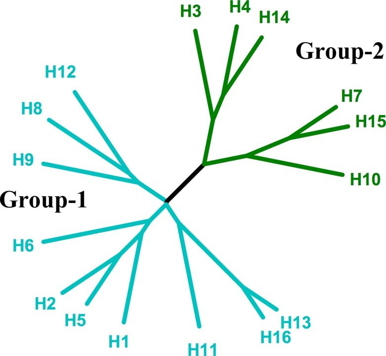{title="Phylogenetic tree of influenza A HAs. The 2 groups are colored cyan (group 1) and green (group 2), each of which can be further subdivided into 3 clades (H8, H9, and H12; H1, H2, H5, and H6; H11, H13, and H16) and 2 clades (H3, H4, and H14; H7, H10, and H15).  https://www.pnas.org/doi/full/10.1073/pnas.0807142105"}
:::

::: {#second}
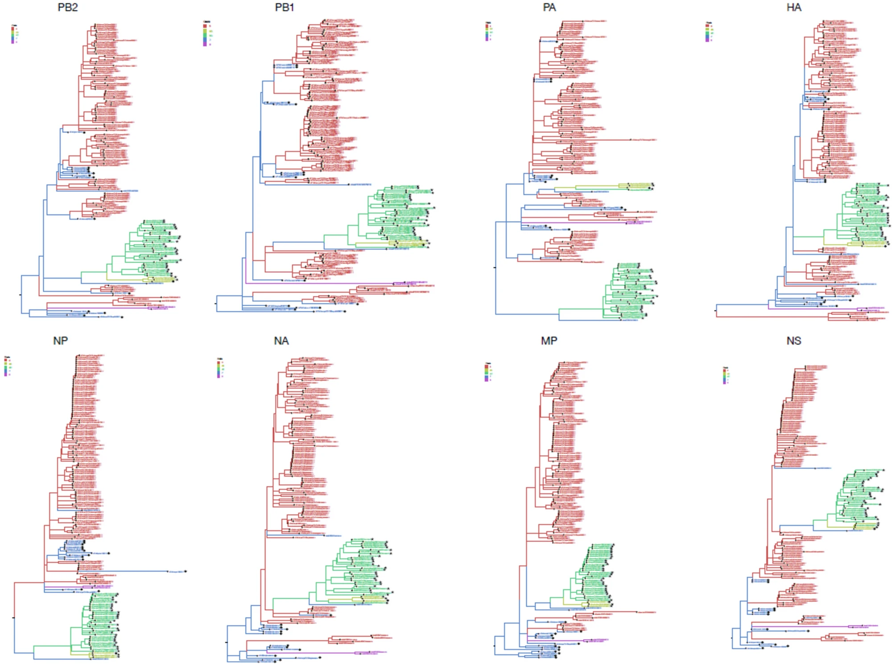{title="Phylogenetic trees of the eight individual gene segments of influenza A(H1N1)pdm09 viruses from sub-Saharan Africa from the 2011–2013 influenza seasons. https://www.nature.com/articles/s41598-024-70023-3"}
:::
:::::

::: notes
**Phylogenetics** is the study of evolutionary relationships among organisms. Typically, this is shown graphically using a phylogenetic tree. In our case, we specifically interrogate the evolution of individual influenza virus subtype gene segments (primarily the HA gene segment).
:::

## Basic Components of a Phylogenetic Tree (Tips)

```{r}
#| code-fold: true
library(ape)
library(ggtree)
library(ggplot2)
library(dplyr)

`%notin%` <- Negate(`%in%`)

# Branch lengths are explicit so we can display them
tree_text <- "((A:1,B:0.5,(C:1.5,D:0.5):0.5):0.5,E:0.5);"
tree <- read.tree(text = tree_text)
tree <- ape::root(tree, "E")

# Basic ggtree base plot
base_plot <- ggtree(tree, branch.length = "branch.length") + theme_tree2()

tips_plot <- base_plot +
  geom_tiplab(offset = 0.02) +        # tip labels
  geom_tippoint(size = 3, shape = 21, fill = "red", colour = "black") +  # highlight tips
  ggtitle("Tips highlighted")

tips_plot
```

::: notes
This may be content you all are already familiar with but I'll go over the very basics of a phylogenetic tree to make sure we're all clear on the concepts. First, the tips in the tree are the terminal nodes and represent the input samples. They are the current descendant taxa being studied.
:::

## Basic Components of a Phylogenetic Tree (Nodes)

```{r}
#| code-fold: true
nodes_plot <- base_plot +
  geom_tiplab(offset = 0.02) +
  # mark internal (non-tip) nodes: use aes(subset = !isTip)
  geom_point2(aes(subset = !isTip), size = 3.5, shape = 21, fill = "green", colour = "black") +
  ggtitle("Nodes highlighted")

nodes_plot
```

::: notes
The next component, internal nodes, represent a common ancestor from which two or more descendant lineages diverged. In this example the node farthest out in this tree would be the common ancestor of samples C and D.
:::

## Basic Components of a Phylogenetic Tree (Branches)

```{r}
#| code-fold: true
branches_plot <- base_plot +
  geom_tiplab(offset = 0.02) +
  # place branch-length labels along branches; use aes(label=branch.length)
  # round to two decimals for display
  geom_label(aes(x = branch, label = round(branch.length, 2)), color = "red") +
  # emphasise branches visually by increasing line width (optional)
  # geom_segment2(aes(subset = !isTip), size = 1.2) +
  ggtitle("Branch lengths labeled (highlighted)")

branches_plot
```

::: notes
Branches on a tree show evolutionary lineages, with the length typically representing the amount of genetic change. Branches connect nodes to descendant tips and clarify groupings.
:::

## Basic Components of a Phylogenetic Tree (Root)

```{r}
#| code-fold: true
Ntip <- length(tree$tip.label)
root_node <- Ntip + 1

tree_df <- fortify(tree) %>%
  mutate(branch_color = case_when(label == "E" ~ "purple",
                              .default = "black"))

root_plot <- ggtree(tree_df, aes(color=I(branch_color))) + theme_tree2() +
  geom_tiplab(offset = 0.02) +
  # mark the root with a star or large point
  geom_point2(aes(subset = (node == !!root_node)), shape = 8, size = 5, colour = "purple") +
  # optionally annotate "root" text
  geom_text2(aes(subset = (node == !!root_node), label = "root"), hjust = -0.5, vjust = -1, size = 4, colour = "purple") +
  geom_hilight(node=5, fill="purple", alpha=.6) +
  geom_text2(aes(subset = (node == 5), label = "Outgroup"), hjust = -0.1, vjust = -2.0, size = 4, colour = "purple") +
  ggtitle("Root and outgroup highlighted")

root_plot
```

::: notes
Lastly, phylogenetic trees attempting to show descendants from a common ancestor, are rooted. The root of the tree represents the last common ancestor of all taxa in the tree. Trees are typically rooted using an outgroup that has a known relative that diverged earlier, in this example, taxa "E".
:::

## Notes on Tree Rooting

Conceptually, tree rooting should be done:

-   Using a known outgroup (a taxon closely related to, but outside, the study group) to place the ancestor
-   Or using midpoint rooting, which sets the root at the midpoint of the longest path between any two taxa

Outgroup rooting provides a more robust evolutionary history, and is generally preferred.

::: notes
Again, to reiterate. Conceptually tree rooting should be done by the following guiding principles of using a known outgroup to place the ancestor or by midpoint rooting if you are unsure of the ancestor. Outgroup rooting provides a more robust evolutionary history, and is generally preferred.
:::

## Types of Trees

::::: {layout="[ 50, 50 ]"}
<div>

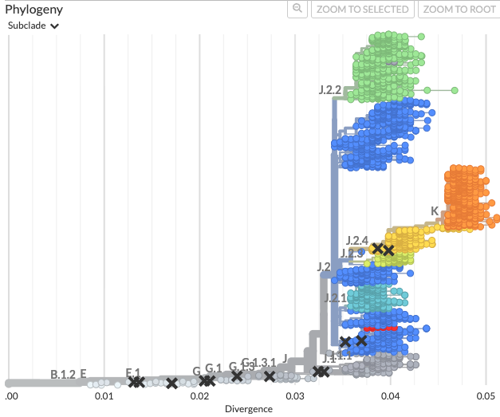

</div>

<div>

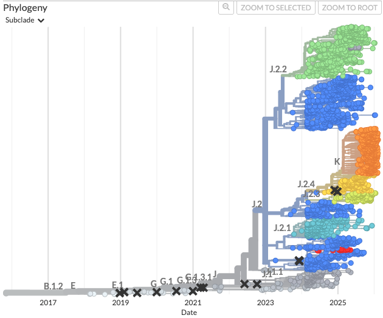

</div>
:::::

::: notes
Now that we've reiterated the key concepts of a phylogeny, I'll go over the types of phylogenetic trees that you'll commonly see displayed.The most common type of tree you'll typically see are divergence scaled trees, where the branch distance represents direct genetic distance of samples to each other or the tree's root. This is shown by the tree on the left. Another type of tree is a time scaled tree, where the branches are instead representative of estimated time divergence. However, the ancestral relationship and branching is still retained in this display. This is shown by the tree on the right.
:::

## Molecular Clock Concept {.smaller}

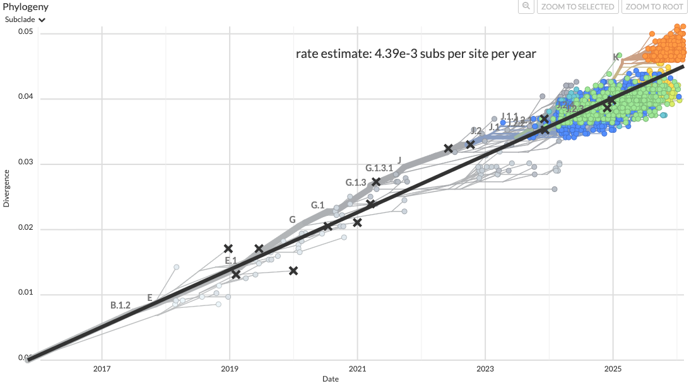

::::: columns
::: {.column width="50%"}
Strict Clock

-   Assumes constant rate accross all lineages
:::

::: {.column width="50%"}
Relaxed Clock

-   Allows rate variation across branches
:::
:::::

::: notes
A core concept behind computing time scaled trees is the molecular clock. Generally, this concept is the idea that genetic mutations accumulate at a roughly constant rate over time, and because of this the genetic difference between taxa can be used to estimate how long ago they shared a common ancestor, given the date information associated with each taxa.

Clock models can be either "strict" or "relaxed". A "strict" clocks assume a constant rate across all lineages, whereas "relaxed" clocks allow rate variation across branches.

The trees we will be creating will be using a strict clock with rates estimated from 12-year phylogenies.
:::

## The Concept of Clades

**Clades** are the fundamental grouping of phylogenetic trees. They are defined as a monophyletic group of taxa in a tree that includes a single common ancestor and all its descendants.

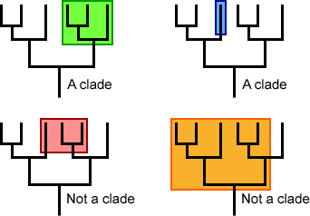{.lightbox width="500"}

::: notes
Within phylogenetic trees, clades are the fundamental grouping. Clades can be just single branches from a tree, or contain numerous branches. But they are often used for tracing ancestry and epidemic spread in the context of virology.
:::

## Clades in Seasonal Influenza

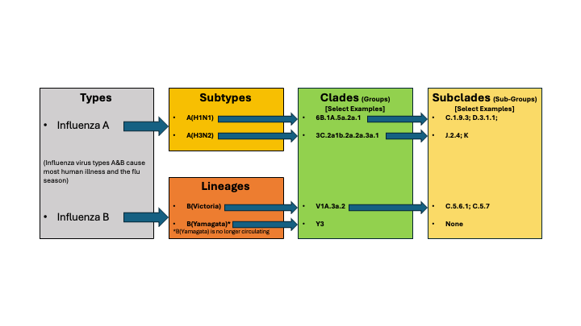

::: notes
As a refresh, for levels of classification for flu. We are first assessing the overall type, for seasonal flu that is type A and B. We further split seasonal flu types into subtypes and lineages, which are related to the HA+NA combinations of the virus. We can then further separate the HA into clades (or genetic groups) which are broader genetic groupings, and then finally into "subclades".
:::

## Clades in Seasonal Influenza (cont.) {.smaller}

The seasonal flu research community recently implemented a [nomenclature and clade proposal system](https://onlinelibrary.wiley.com/doi/10.1111/irv.70230) for tracking important emerging clades. These correspond to the "subclade" designations from [Nextclade](https://clades.nextstrain.org/) outputs.

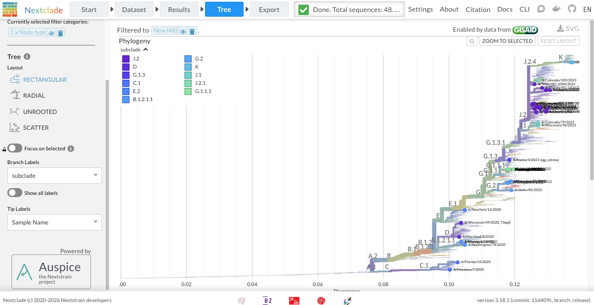{width="1167"}

::: notes
For subclades, the seasonal flu research community recently implemented a nomenclature and clade proposal system for tracking important emerging clades. These correspond to the "subclade" designations from Nextclade outputs.
:::

## Clades in Seasonal Influenza (cont.)

Defining a subclade in Nextstrain ([`augur clades` command](https://docs.nextstrain.org/projects/augur/en/stable/usage/cli/clades.html)):

::::: columns
::: {.column width="50%"}
| clade | gene | site | alt |
|:------|:-----|:-----|:----|
| A     | HA1  | 45   | N   |
| A     | HA1  | 48   | I   |
| A     | nuc  | 473  | T   |
:::

::: {.column width="50%"}
| clade | gene  | site  | alt |
|:------|:------|:------|:----|
| K     | clade | J.2.4 |     |
| K     | HA1   | 2     | N   |
| K     | HA1   | 144   | N   |
| K     | HA1   | 158   | D   |
| K     | HA1   | 160   | K   |
| K     | HA1   | 173   | R   |
:::
:::::

::: notes
Subclades are defined in Nextstrain builds using a four column tab separated file. With the columns "clade", "gene", "site", and "alt". The "clade" column is the desired definition of the clade to be annotated, the "gene" column is the site level to be evaluated (using a specific protein, nucleotide, or clade), the "site" column is the numeric site or parent clade required, and the "alt" column is the nucleotide or amino acid present at the given site. In essence, we are listing the required ancestry for the originating subclade node.
:::

## Clades in Seasonal Influenza (cont.) {.smaller}

Subclade K example:

::::: columns
::: {.column width="30%"}
| clade | gene  | site  | alt |
|:------|:------|:------|:----|
| K     | clade | J.2.4 |     |
| K     | HA1   | 2     | N   |
| K     | HA1   | 144   | N   |
| K     | HA1   | 158   | D   |
| K     | HA1   | 160   | K   |
| K     | HA1   | 173   | R   |
:::

::: {.column width="70%"}
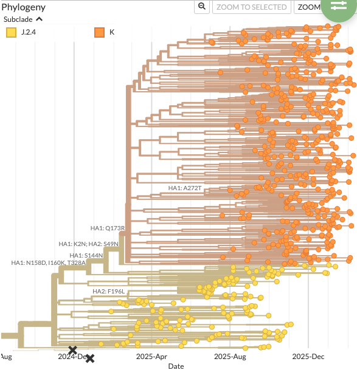{fig-align="right" width="545"}
:::
:::::

::: notes
As you can see from this example showing subclade K and its clade definitions to the left. The ancestral changes we've defined are reflected in the tree branching leading up to subclade K. Manual subclade definitions could also be added to highlight a non-official clade of interest in a Nextstrain build.
:::

## Subclades vs. Lineages (Pango 🤦)

Influenza subclades are **not** equivalent to [Pango (SARS-CoV-2) lineages](https://web.archive.org/web/20240116214047/https://www.pango.network/how-does-the-system-work/what-are-pango-lineages/).

\

Pango lineage designations only requirement is a group of viruses having a shared ancestry.

\

Lineage proposals are through [public submission](https://github.com/cov-lineages/pango-designation/tree/master?tab=readme-ov-file)

This has led to the designation of 5.7K+ lineages. 🤯

::: notes
Although seasonal influenza subclades might look topically similar to pango lineages for SARS-CoV-2 they are not equivalent. The only requirement for the designation of a pango lineage is a group of viruses that have a shared ancestry. This can be from a single synonymous mutation that has no affect on the viral protein structure. This unrestricted system of lineages has led to the designation of more than 5,700 lineages. Along with a complete alphabet soup of lineage names.
:::

## Subclade Proposal Process {.smaller}

Subclade proposal criteria:

1.  Size: large groups should have a higher priority for designation.
2.  Divergence: the more mutations have accumulated relative to the break point of the parent clade, the higher the priority of a novel clade
3.  Specific mutations: Ideally, breakpoints sit on long branches with significant mutation. Such mutations will be better defined for well studied segments/genomes.

Each of these components feeds into the calculation of normalized branch scores across a phylogenetic tree.

\

A threshold score of 1.0 is set.

::: notes
There are three criteria for subclade proposal. First being size, with larger groups having a higher priority of designation. Second, divergence, with more mutations accumulated, the higher the priority. And lastly, specific mutations of significance. These mutations get weighted higher for designation.

Each of these components feeds into the calculation of normalized branch scores across the tree, with a threshold value of one set. This chosen threshold means that any one score criteria alone will not trigger a new lineage, but together, the threshold can be passed with a single HA1 mutation.
:::

## Subclade Naming

-   The system of subclade naming uses a variation of the Pango nomenclature system.[^1]
-   Capitol letters are used as aliases and numbers separated by periods for the retained part of the hierarchical name.
-   Shortening (aliasing) of names after three hierarchical levels (i.e. D for C.1.1.1).
-   However, a new alias may be given earlier in the case of a rapid expansion or special designation.

[^1]: [The full publication on the nomenclature system.](https://onlinelibrary.wiley.com/doi/full/10.1111/irv.70230)

::: notes
The system of subclade naming uses a variation of the Pango nomenclature system, where capitol letters are used as aliases and numbers separated by periods for the retained part of the hierarchical name.

Shortening (or aliasing) of names generally occurs after three hierarchical levels, but a new alias may be given earlier in the case of a rapid expansion or special designation.
:::

## Example of Implementation Using H3N2 HA {.smaller}

```{r}
#| code-fold: true
library(networkD3)
library(data.tree)
library(htmlwidgets)
library(collapsibleTree)
library(yaml)
library(viridis)

# Create tree via a nested yaml string
yaml <- "
name: A (3C)
A.2 (3C.2):
  B (*A.2.1):
    B.1:
      B.1.1:
      B.1.2:
        B.1.2.1:
          D (*B.1.2.1.2):
        E (*B.1.2.2):
          E.1:
            F (*E.1.1):
              F.1:
                F.1.1:
            G (*E.1.2):
              G.1:
                G.1.1:
                  G.1.1.1:
                  G.1.1.2:
                G.1.2:
                G.1.3:
                  G.1.3.1:
                    J (*G.1.3.1.1):
                      J.1:
                        J.1.1:
                      J.2:
                        J.2.1:
                        J.2.2:
                        J.2.3:
                        J.2.4:
                          K (*J.2.4.1):
                        J.2.5:
                      J.3:
                      J.4:
                  G.1.3.2:
              G.2:
                G.2.1:
                G.2.2:
              G.3:
              G.4:
          E.2:
  B.2:
  B.3:
  B.4:
A.3 (3C.3):
  C (*A.3.1):
    C.1
  A.3.2:
"

# Load the yaml tree into a list
h3List <- yaml.load(yaml)

# Transform into a data.tree object
h3Node <- as.Node(h3List, interpretNullAsList = TRUE)

# Assign a vector of colors for nodes
h3Colors <- viridis::turbo(h3Node$totalCount)

# Assign colors to tree nodes
i <- 1
h3Node$Do(function(node) {
  node$color <- h3Colors[i]
  i <<- i + 1
})

# Display collapsible tree
collapsibleTree(h3Node,
                fill = "color",
                tooltip = TRUE)
  
```


# Section 2: <br>Tree Building Overview

::: notes
Now that we've gone over the basics of phylogenetics. I'll give an overview to the process of building a
phylogenetic tree. Although we won't be directly creating a tree ourselves, it's important to understand
the background of how a tree is created when evaluating one.
:::

## Phylogenetic Tree Building Steps

```{mermaid}
%%| echo: false
%%| fig-align: center
flowchart TD
    A[Sequence selection and filtering]
    style A text-align:center
    B[Multiple sequence alignment]
    style B text-align:center
    C[Model selection]
    style C text-align:center
    D[Tree inference]
    style D text-align:center
    E[Tree evaluation and visualization]
    style E text-align:center

    A -->  |The data that is <br/> included is **important**| B
    B --> C 
    C --> |Also important for <br/> proper tree contruction| D
    D --> E
```

::: notes
The overall steps of phylogenetic tree building are:

1.  Sequence selection and filtering. This is one of the most critical steps in tree building and is often not as heavily considered as it should be. It is very central to the focus of the analysis.
2.  Multiple sequence alignment
3.  Model selection. This is also important for tree construction. An inappropriate model selection can produce inaccurate topologies and lead to false conclusions from your data.
4.  Tree inference. The algorithm used for inference of the tree can impact the topology. There are many methods depending on your overall goals. A neighbor joining algorithm may be sufficient for a quick assessment, or a maximum likelihood method for more robust statistical support, or a Bayesian method for robust phylogenetic reconstruction and divergence time estimation.
5.  Tree evaluation and visualization. Lastly, understanding and interpreting your tree by visualization is critical to hypothesis testing and evolutionary analysis.
:::

## Sequence Selection

::::: {layout="[ 50, 50 ]"}
<div>

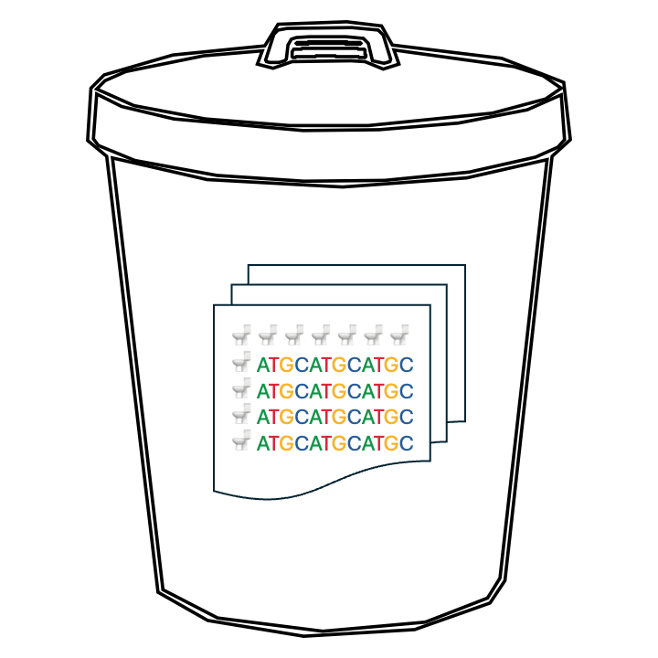

</div>

<div>

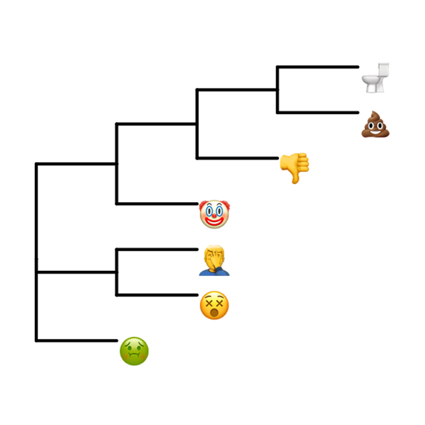

</div>
:::::

::: notes
On a very basic level, the importance of sequence selection for a tree cannot be understated. Ultimately a tree is a hypothesis, using sequences of poor quality or not tailoring your data to a particular research question will give you poor results. Garbage in. Garbage out.
:::

## Sequence Selection {.smaller}

When starting the process of building a tree:

::: incremental
-   Consensus sequence data quality (not just NGS coverage)

-   What is the question you are trying to address?

    -   Global surveillence?

    -   Targeted regional analysis?

    -   Country specific questions?

    -   Timing of a newly emerged variant?

        -   *Be especially careful here. This requires intensive analysis and scrutiny. Understand the limitations of analysis.*
:::

::: notes
When starting the process of building a tree there are many things to consider. But the primary actions should revolve around including sequences with high data quality and making sure your sequence selection is appropriate for the question you are trying to address. Selection will be drastically different whether your question is focused around global surveillance, a targeted regional analysis, a country specific question, or the timing of a newly emerged variant. This last question requires especially careful consideration in dataset selection and the limitations of the analysis should be well understood.
:::

## Multiple Sequence Alignment (MSA)

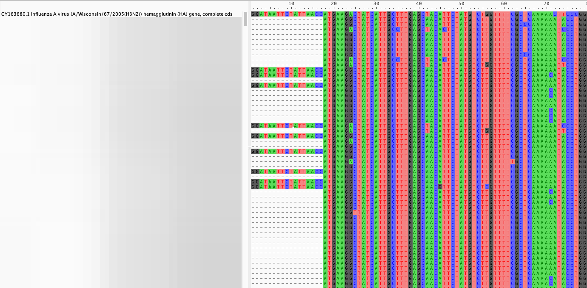

::: notes
After appropriate filtering and sampling, there is the process of generating a multiple sequence alignment (or MSA). There are many different multiple sequence alignment algorithms and each have their own advantages and disadvantages.
:::

## MSA Algorithms

Examples of MSA software:

-   [CLUSTAL Omega](https://www.ebi.ac.uk/jdispatcher/msa/clustalo)
-   [MAFFT](https://mafft.cbrc.jp/alignment/server/index.html)
-   [MUSCLE](https://github.com/rcedgar/muscle)
-   [**nextclade** aligner (previously nextalign)](https://github.com/nextstrain/nextclade?tab=readme-ov-file)

::: notes
Some common examples of MSA alignment software are CLUSTAL, MAFFT, MUSCLE, and the Nextclade aligner. Nextclade is the default aligner used by Nextstrain in their core pathogen workflows. MAFFT is also available as an aligner installed as part of the Nextstrain environment. Generally, in Nextstrain builds we are aligning the data to a specific reference sequence rather than doing a true global sequence alignment. This keeps numbering consistent in relation to the reference, allowing better contextualization of analysis.
:::

## Model Selection

Assuming nucleotide sequence data as input:

-   Jukes-Cantor (simplest model)[^2]
-   HKY
-   TN93
-   GTR (Model implemented in Nextstrain flu pipelines)

[^2]: Model references can be found [**here**](https://onlinelibrary.wiley.com/doi/full/10.1111/irv.70230)

::: notes
Assuming nucleotide sequence data as input, there are a number of substitution models available for tree inference. Jukes-Cantor is the simplest model and assumes equal base frequencies and mutation rates. HKY and TN93 models distinguish between the rate of transitions and transversions, with different model specific parameters for each. The GTR model is the most general neutral, independent, finite-sites, time-reversible model possible. GTR is also the model implemented in Nexstrain flu pipelines.
:::

## Tree Inference - Algorithms

Distance Based:

-   Neighbor joining
-   UPGMA

Character Based:

-   Maximum Parsimony
-   Maximum Likelihood (used in Nextstrain pipelines)
-   Bayesian Inference

::: notes
When inferring a tree, there are two major groups of algorithms. Distance based and character based. Distance based algorithms such as neighbor joining and UPGMA construct trees by converting data into a matrix of pairwise evolutionary distances. This can be useful for quick assessments of data where intense accuracy is not needed. Character based methods are generally preferred, with the most common implementation being maximum likelihood. With modern computing maximum likelihood has a good balance between accuracy and speed. Bayesian inference are the most intensive method, often requiring days to run a medium sized data set to completion.
:::

## Tree Inference - Software

-   [MEGA](https://www.megasoftware.net/)
-   [RAxML](https://cme.h-its.org/exelixis/web/software/raxml/)
-   [FastTree](https://morgannprice.github.io/fasttree/)
-   [IQ-TREE (Nextstrain Default)](https://iqtree.github.io/)
-   [cmaple (Standalone program and within IQ-TREE using\
    `--pathogen` flag)](https://github.com/iqtree/cmaple)

::: notes
Common software implementing tree building methods are MEGA, which provides a robust toolkit in a graphical user interface and other command line tools such as RAxML, FastTree, and IQ-TREE, and cmaple. With IQ-TREE being the maximum likelihood program implemented in Nexstrain tree building defaults.
:::

## Tree Evaluation and Visualization {.smaller}

-   [Nextstrain (auspice)](https://docs.nextstrain.org/projects/auspice/en/stable/)
-   [auspice.us (browser based auspice)](https://auspice.us/)
-   [IcyTree (browser based)](https://icytree.org/)
-   [FigTree](https://tree.bio.ed.ac.uk/software/figtree/)
-   [ITOL](https://itol.embl.de/)
-   [Dendroscope](https://uni-tuebingen.de/fakultaeten/mathematisch-naturwissenschaftliche-fakultaet/fachbereiche/informatik/lehrstuehle/algorithms-in-bioinformatics/software/dendroscope/)
-   [archaeopteryx](https://www.phylosoft.org/archaeopteryx/)
-   Programmatic libraries:
    -   [ETE Toolkit](https://etetoolkit.org/)
    -   [ggtree](https://guangchuangyu.github.io/software/ggtree/)

::: notes
After building a tree there are a number of software options available to view the tree. Although we'll be using the Nextclade and the auspice 
software from Nextstrain to view our trees, it is good to have other software on hand for quick inspection, annotation, format conversion, or figure 
generation from tree files. I prefer FigTree for this. There's also programmatic libraries in python and R which can be very helpful for publication 
quality figures.
:::

## Intro to Nextstrain

[Nextstrain](https://docs.nextstrain.org/en/latest/learn/about.html#) is an open source toolkit for analyzing and visualizing pathogen genomic data.

The two core parts of Nextstrain are:

-   Augur (modular bioinformatics toolkit)
-   Auspice (browser based vizualization)

::: notes
Now that we've gone through the basics of tree building, we'll go over Nextstrain. Nextstrain is an open source toolkit for analyzing and visualizing
pathogen genomic data. The two main components of the software are augur and auspice. Where augur is a packaged toolkit of bioinformatics tools and 
auspice is the web browser based visualization software designed for the output of augur.
:::

## Nextstrain process overview

```{mermaid}
%%| echo: false
%%| fig-align: center

flowchart TB
    subgraph Inputs
        direction LR
        A[sequences.fasta]
        B[metadata.tsv]
    end

    subgraph Augur
    direction LR
        C(filter)
        D(align)
        E(tree)
        F(refine)
        G(export)
        C --> D
        D --> E
        E --> F
        F --> G
    end

    Inputs --> Augur
    Augur --> H[Build Dataset]
    H --> I[Auspice]

     %% Styling
    classDef input fill:#ffffff,stroke:#555,rx:12,ry:12;
    classDef step fill:#bfe3ff,stroke:#3b82c4,rx:14,ry:14;
    classDef output fill:#ffffff,stroke:#555,rx:12,ry:12;
    classDef final fill:#b9f5b0,stroke:#2e7d32,rx:14,ry:14;

    class A,B input;
    class C,D,E,F,G step;
    class H output;
    class I final;
```

::: notes
The essential components of a Nextstrain workflow are shown in this diagram. You'll notice, as I go though that these pipeline steps directly
replicate all the previous steps I described in the tree generation process. Generally, as input we are providing a sequence file in fasta format and
a columnar data file associated with our sequence file. These files are then taken through the augur pipeline. First, the "filter" step is used to 
sample data by defined criteria. Then the filtered sequence data is aligned to a provided reference in the "align" step. A tree is then built from 
this alignment using the "tree" command. The tree is then processed through the "refine" step, which refines the tree using sequence metadata, 
removes outliers, and produces a time scaled phylogeny. All of the essential files needed for a Nextstrain build are then processed in the export 
step, where the files are combined into one or more JSON files. These JSON files form a "build" data set, which can then be directly viewed in 
auspice.
:::

## Intro to Nextclade {.smaller}

[Nextclade](https://docs.nextstrain.org/projects/nextclade/en/stable/user/nextclade-web/index.html) is an application
that Processes FASTA sequences through alignment, mutation calling, clade assignment, phylogenetic placement, and QC.
With results in tabular and phylogenetic tree format.

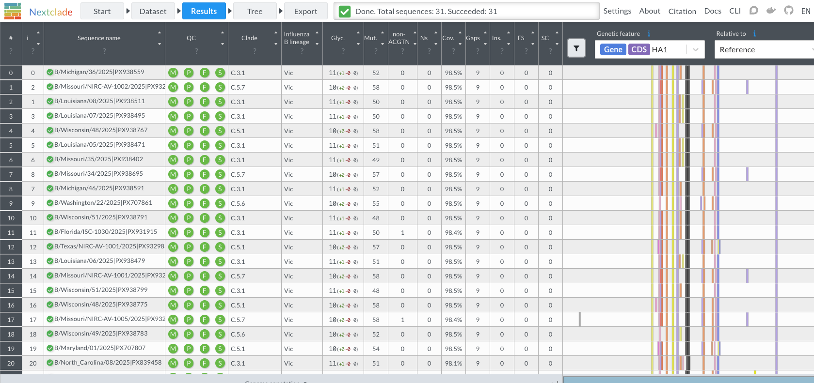

::: notes
Although nextstrain is a a great tool, it is often not needed to create an entire phylogenetic
tree from scratch to assess sequences. This is where nextclade can come into play. Nextclade is an 
application that Processes FASTA sequences through alignment, mutation calling, clade assignment, 
phylogenetic placement, and QC. With results in tabular and phylogenetic tree format.
:::

## **Nextclade** Phylogenetic Placement {.smaller}

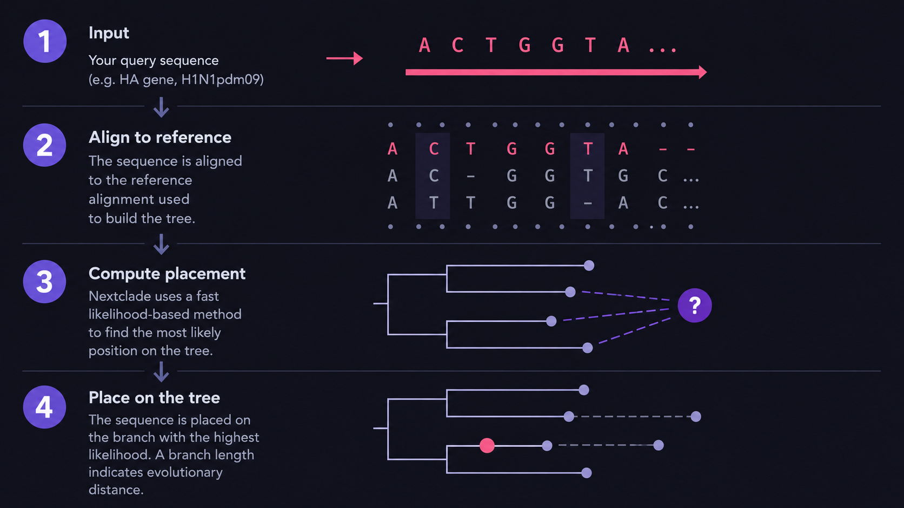

::: {.callout-warning}
Note that placement is **NOT** as accurate as true phylogenetic inference.
:::

::: notes
Nextclade computes placement through a fast likelihood based method post alignment, 
comparing the input query sequences against the reference sequences in the template
tree to find the nearest reference node. Mutations that separate the query sequence 
and the nearest reference node in the tree are designated as "private mutations", which
can serve as a flag for highly divergent or problematic sequences of low quality.

It is important to not though, that placement is not a replacement for phylogenetic 
inference. Although it is useful for approximating samples relative evolutionary divergence.
:::

# Section 3: <br>Nextclade Practical

## Practical

Go to the following sites in separate tabs:

- [https://clades.nextstrain.org/](https://clades.nextstrain.org/)
- [https://nextstrain.org/pathogens?filter=seasonal-flu](https://nextstrain.org/pathogens?filter=seasonal-flu)

Download the following dataset:

- [https://github.com/nhassell/seasonal-flu-demo/blob/master/demo_files.zip](https://github.com/nhassell/seasonal-flu-demo/blob/master/demo_files.zip)

We'll walk through the practical together.
